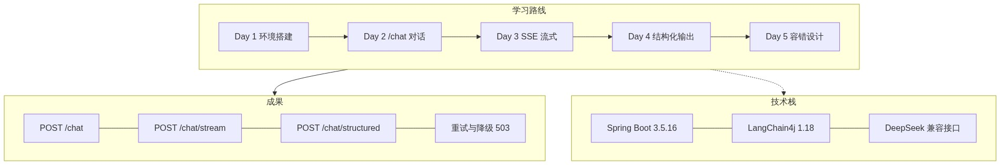
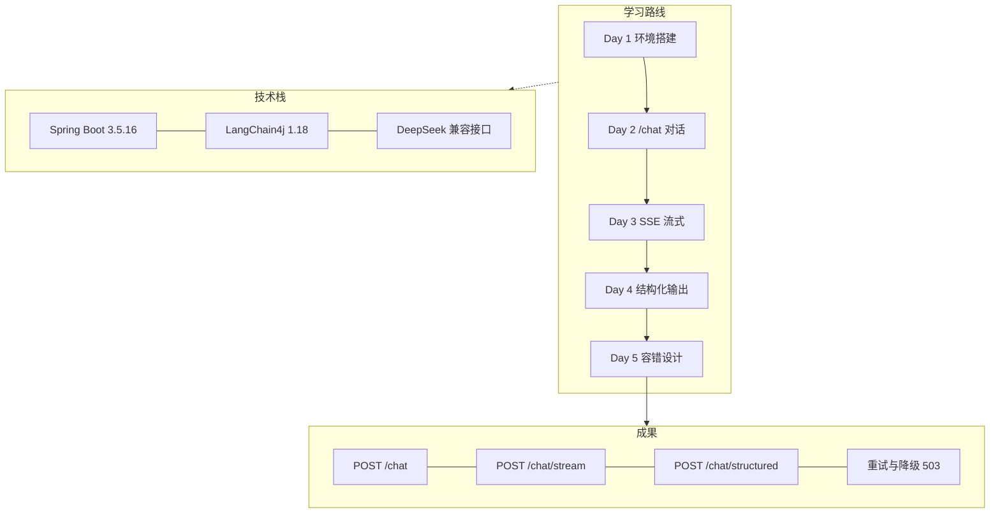

# Week 1 周总结：LLM 应用开发基础

- 日期范围：2026-08-11 ~ 2026-08-16

## Week 1 汇总图

## 已完成

| Day | 内容 | 成果 |
| --- | --- | --- |
| Day 1 | 环境搭建 | JDK 21（Temurin）/ Maven / Spring Boot 3.5.16 / LangChain4j 1.18.1 / DeepSeek 配置，`/actuator/health` UP |
| Day 2 | `/chat` 对话接口 | 消息列表 → 文本回复、System Prompt、参数校验、统一错误处理（400/502），真实联调通过 |
| Day 3 | `/chat/stream` SSE 流式 | SseEmitter + LangChain4j 流式 API + UTF-8 修复，真实流式联调通过（多分块 + [DONE]） |
| Day 4 | `/chat/structured` 结构化输出 | 5 个场景 schema（extract/ticket/classify/resume/product），双模式 json_object/json_schema，真实联调通过 |
| Day 5 | 容错设计 | ResilientCaller（重试/超时/备用模型降级/503），真实链路联调通过 |
| 全程 | 工具链 | IDEA 升级解决 Java 21 红字、Apifox 调试、requests.http、GitHub 仓库上线并每日同步 |

## 遇到的问题 / 踩坑

- GitHub 下载 JDK 极慢 → 换清华镜像（2 秒完成）
- PowerShell 写文件带 BOM 导致 Java 编译失败 → 改无 BOM UTF-8 写入
- start.spring.io 不再支持 Spring Boot 3.5.x → 手写 pom
- IDEA 2020.2 不支持 Java 21（record 等）→ 升级新版本
- LangChain4j 1.x 移除旧 `generate()` → 改用 `chat()` + `ChatResponse`
- SSE 默认 ISO-8859-1 中文乱码 → 显式 `setCharacterEncoding("UTF-8")`
- DeepSeek 不支持原生 `json_schema` response_format → 用 `json_object` + prompt 强化 + 服务端字段校验
- 不可重试错误不能降级（会吞错误返回 null）→ 仅可重试错误走重试/降级

## 新学到的技术点

- **LLM 应用基础**：Token、Context Window、Message 角色（system/user/assistant）、Prompt、Temperature、Streaming、Structured Output、Function Calling（了解）、Retry/Timeout/Fallback
- **LangChain4j 1.18**：`OpenAiChatModel` / `OpenAiStreamingChatModel` / `JsonSchema` 体系 / 异常体系（Retriable vs NonRetriable）
- **DeepSeek 接入**：OpenAI 兼容协议，换模型只改 base-url/model
- **SSE 流式**：`text/event-stream`、SseEmitter、与 WebSocket 的区别
- **JSON Schema 结构化输出**：接口复用、输出即契约、双模式与供应商差异
- **容错设计**：指数退避重试、超时、备用模型降级、错误码约定（400/502/503）
- **测试分层**：单测（mock 模型，不花钱）→ 控制器测试（MockMvc）→ 真实联调 LiveTest（默认跳过，设 Key 才跑）
- **工程化**：Spring Boot 分层、@ConfigurationProperties、统一异常处理、README/requests.http、git 分支与同步

## 需要下周继续弄清楚的

- Week 2 **Tool Calling**：Function Calling 原理、@Tool、Agent Loop（预告：工具参数本质就是结构化输出）
- MCP（Week 4 预告）
- Docker 环境（Day 1 遗留：`scripts/install-docker.ps1` 待管理员执行）
- 流式接口的重试策略（本周流式未做重试，流中无法安全重放）
- 多轮对话 Memory（Sprint 4）

## 知识库更新记录

- 归档：`05-记录/归档/` —— 2026-08-11-Day1、2026-08-12-Day2、2026-08-13-Day3、2026-08-14-Day4、2026-08-16-Day5、2026-08-16-结构化输出场景扩展
- 笔记：`02-知识库/LLM应用开发/` —— DeepSeek配置、LangChain4j-Chat实现、技术原理与请求流程、SSE流式输出、JSON-Schema结构化输出、容错设计-Retry-Timeout-Fallback、本机环境
- 资料源：`03-资料源/README.md`（Level 1~5 规则 + 官方链接）
- 项目：Sprint 0、Sprint 1 全部完成；GitHub 仓库 https://github.com/cgllzl/learning-ai-agent 已上线
- 测试：35 个自动化测试 + 真实联调（流式、结构化 3 场景）全部通过

## 下周目标

- Week 2：Tool Calling —— 做「企业订单 Agent」（查询订单/用户/物流/商品、修改订单状态）