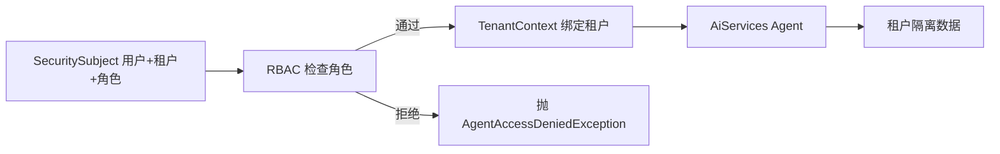

# Day 2：给 Agent 接入 RBAC 与租户隔离

> Week 5 ｜ 归档：`05-记录/归档/2026-08-30-Week5-Day2-RBAC与租户隔离.md` ｜ 代码：`com.enterprise.agent.security`

## 一、两个概念，先各给一个生活类比

### RBAC：你不是一个人，而是一个角色

RBAC 是 **Role-Based Access Control**，基于角色的访问控制。它不问「你是谁」，而问「你是什么角色」：

- `CUSTOMER_SERVICE`：能查订单、用户、物流。
- `ORDER_ADMIN`：能改订单状态。
- `EMPLOYEE`：能查公司制度，但不能碰订单。

类比：公司门禁卡。同一个人的卡上可能印着「客服」或「管理员」，不同角色的卡能刷开的门不一样。我们做权限时不是给每个人单独配置，而是给「角色」配置，再把人分到角色里。

### 租户隔离：同一栋楼，但每家公司都有自己的保险柜

多租户 SaaS 里，多个企业共用一套系统，但**每个租户只能看到自己的数据**。同一个订单号 `O1001`，在 A 公司和 B 公司可能是完全不同的订单。

类比：一栋写字楼里很多家公司。大家都在同一部电梯、同一个前台，但档案室给每家公司分了一个独立保险柜，A 公司的人绝对拿不到 B 公司的文件。

## 二、本项目怎么把这两个概念接进 Agent

我们新增了一个「安全版订单 Agent」，它和原来的 `OrderAgentService` 思路一样，但多了两层门：



### 第 1 步：先定义「当前用户是谁」

```java
public record SecuritySubject(String userId, String tenantId, Set<String> roles) {
    public boolean hasRole(String role) {
        return roles.contains(role);
    }
}
```

解释：

- `userId`：具体是谁；
- `tenantId`：属于哪个租户；
- `roles`：拥有哪些角色。

这个对象就是后续所有安全判断的输入。它用一个不可变的 `record` 表示，避免运行期被偷偷改掉。

### 第 2 步：用 RbacService 检查角色

```java
public class RbacService {

    public boolean hasAnyRole(SecuritySubject subject, String... requiredRoles) {
        Set<String> roles = subject.roles();
        return Arrays.stream(requiredRoles).anyMatch(roles::contains);
    }

    public void checkAnyRole(SecuritySubject subject, String... requiredRoles) {
        if (!hasAnyRole(subject, requiredRoles)) {
            throw new AgentAccessDeniedException(
                    "用户 " + subject.userId() + " 缺少所需角色之一：" + Arrays.toString(requiredRoles));
        }
    }
}
```

解释：

- `String...` 是 Java 的**可变参数**：调用时可以写 `checkAnyRole(subject, "CUSTOMER_SERVICE", "SUPERVISOR")`，也可以传一个数组。
- `Arrays.stream(...).anyMatch(...)`：只要用户拥有「所需角色中的任意一个」就通过。
- `checkAnyRole` 是「不通过就抛异常」的版本，适合放在 Agent 入口做拦截。

### 第 3 步：用 ThreadLocal 绑定租户上下文

```java
public final class TenantContext {

    private static final ThreadLocal<SecuritySubject> HOLDER = new ThreadLocal<>();

    public static <T> T run(SecuritySubject subject, Supplier<T> action) {
        HOLDER.set(subject);
        try {
            return action.get();
        } finally {
            HOLDER.remove();
        }
    }

    public static String requiredTenantId() {
        return current().tenantId();
    }
}
```

这里有两个点值得理解：

- **`ThreadLocal`**：每个线程都有一个自己的「小抽屉」，放进去的 `SecuritySubject` 只有当前线程看得见，不会串到别的请求。
- **`run(...)` 模板**：进去时 `set`，出来时 `remove`，保证这个抽屉用后即清。这样即使同一线程复用，也不会残留上一个请求的租户。

这样下游的 Tool 不用层层传 `tenantId`，直接 `TenantContext.requiredTenantId()` 就能拿到当前租户。

### 第 4 步：数据按租户分开放

```java
public class TenantScopedOrderData {

    private final Map<String, Map<String, String>> ordersByTenant = new LinkedHashMap<>();

    public TenantScopedOrderData() {
        put("t1", "O1001", "订单 O1001：用户 U1，商品 机械键盘，金额 399.0 元，状态 PAID");
        put("t2", "O1001", "订单 O1001：用户 U2，商品 27寸显示器，金额 1299.0 元，状态 SHIPPED");
    }

    public Optional<String> find(String tenantId, String orderId) {
        return Optional.ofNullable(ordersByTenant.getOrDefault(tenantId, Map.of()).get(orderId));
    }
}
```

解释：外层 Map 的 key 是租户，内层 Map 的 key 是订单号。同一个 `O1001` 在 `t1` 和 `t2` 里是不同的内容，这就实现了最直接的租户隔离。

### 第 5 步：工具读取当前租户的数据

```java
public class TenantOrderTools {

    private final TenantScopedOrderData data;

    @Tool("根据订单号查询订单信息")
    public String getOrder(@P("订单号，例如 O1001") String orderId) {
        String tenantId = TenantContext.requiredTenantId();
        return data.find(tenantId, orderId)
                .orElse("未找到订单 " + orderId);
    }
}
```

注意：`tenantId` 不是从模型参数里来的，而是从 `TenantContext` 取的。模型想查哪个租户都没用，数据源头已经被租户上下文限制住了。

### 第 6 步：在 Agent 入口接上 RBAC 和租户绑定

```java
public class SecureOrderAgentService {

    private final RbacService rbacService;
    private final TenantOrderAssistant assistant;

    public SecureOrderAgentService(OpenAiChatModel chatModel, RbacService rbacService) {
        this.rbacService = rbacService;
        this.assistant = AiServices.builder(TenantOrderAssistant.class)
                .chatModel(chatModel)
                .tools(new TenantOrderTools(new TenantScopedOrderData()))
                .build();
    }

    public String chat(SecuritySubject subject, String message) {
        rbacService.checkAnyRole(subject, "CUSTOMER_SERVICE", "SUPERVISOR");
        return TenantContext.run(subject, () -> assistant.chat(message));
    }
}
```

执行顺序很清楚：

1. 先过 RBAC，角色不对直接抛异常；
2. 角色对了，再把当前用户放进 `TenantContext`；
3. 最后才让大模型用工具回答。

## 三、大模型例子：三个请求验证三个结论

`SecureOrderLiveTest` 用真实 DeepSeek 跑了三个请求：

| 请求 | 结论 | 预期结果 |
| --- | --- | --- |
| 租户 `t1` 的客服查 O1001 | 租户隔离 | 回复含 `399` |
| 租户 `t2` 的客服查 O1001 | 租户隔离 | 回复含 `1299` |
| 只有 `EMPLOYEE` 角色的用户查 O1001 | RBAC | 抛 `AgentAccessDeniedException`，不调大模型 |

真实输出里，两个租户拿到的是完全不同的订单内容：

```text
[租户 t1 回答] 订单 O1001 ... 金额 399.0 元 ...
[租户 t2 回答] 订单 O1001 ... 金额 1299.0 元 ...
```

这个例子同时验证了两件事：

- **RBAC**：没有 `CUSTOMER_SERVICE` / `SUPERVISOR` 角色，根本进不了 Agent。
- **租户隔离**：同样问 O1001，两个租户只能看到自己的数据。

## 四、如何本地测试

```powershell
cd F:\ChatGPT\学习之路\04-项目\enterprise-agent

# 1) 不调大模型，验证 RBAC 与租户数据隔离
mvn test -Dtest=RbacServiceTest,TenantScopedOrderDataTest

# 2) 真实 DeepSeek 联调：RBAC + 租户隔离
.\scripts\test-live.ps1 -Test SecureOrderLiveTest
```

## 五、Day 2 完成标准

- [x] 给 Agent 接入 RBAC：按角色判断是否能进入 Agent
- [x] 给 Agent 接入租户隔离：数据按 tenantId 隔离
- [x] 有真实调用大模型的例子（`SecureOrderLiveTest`）
