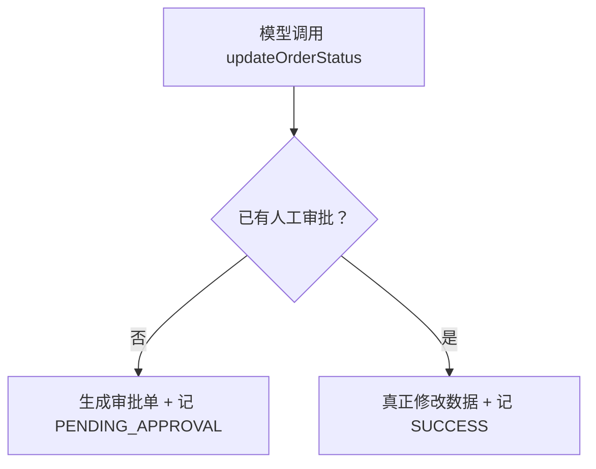

# Day 6：审计日志 + 高危操作人工审批流

> Week 5 ｜ 归档：`05-记录/归档/2026-08-31-Week5-Day6-审计日志与人工审批.md` ｜ 代码：`com.enterprise.agent.security.ApprovalAwareOrderTools`

## 一、先讲人话：这一天解决两个问题

前面几天已经做到：

- 谁能进 Agent（RBAC）；
- 谁的数据能看（租户隔离）；
- 谁有哪些工具（Tool 权限）；
- 可疑输入被拦截（Prompt Injection）；
- 密钥不泄露（Secret 管理）。

但还差两个「企业级」能力：

1. **审计日志**：谁在什么时候调了什么工具、结果如何，必须留痕，出问题能回溯。
2. **人工审批**：像「改订单状态」这种高危操作，不能让模型自动完成，必须由人类确认后才真正执行。

类比：

- 审计日志 = 监控摄像头：平时不打扰你，出事后能回放。
- 人工审批 = 双人复核：转账、改重要数据，必须第二个人签字。

## 二、审计日志怎么落地

先定义一条日志长什么样：

```java
public record AuditLogEntry(
        Instant timestamp,
        String userId,
        String tenantId,
        String toolName,
        String arguments,
        String result,
        AuditStatus status) {
}
```

解释：每一条日志都回答「**什么时候、谁、在哪个租户、调了什么工具、传了什么参数、得到什么结果、最终状态是什么**」。生产环境通常写数据库或日志系统，这里用内存列表，方便学习。

记录动作的枚举：

```java
public enum AuditStatus {
    SUCCESS,
    PENDING_APPROVAL,
    DENIED
}
```

## 三、人工审批怎么落地

`HumanApprovalService` 用两个集合表达审批状态：

```java
private final Map<String, PendingApproval> pending = new ConcurrentHashMap<>();
private final Set<String> granted = ConcurrentHashMap.newKeySet();
```

解释：

- `pending`：等待人工处理的审批单。
- `granted`：已经被人工批准的「订单号 + 新状态」组合。
- 高危工具第一次调用时，只往 `pending` 加审批单，不真正执行；人工 `approve()` 后，`granted` 才出现，工具才能执行。

## 四、把两个能力接进工具

```java
@Tool("修改订单状态。只有 PENDING 的订单可以修改...")
public String updateOrderStatus(@P("订单号") String orderId,
                                @P("新状态") String newStatus) {
    SecuritySubject subject = TenantContext.current();
    String arguments = orderId + " -> " + newStatus;

    if (!approvalService.isApproved(orderId, newStatus)) {
        PendingApproval approval = approvalService.requestApproval(orderId, newStatus);
        String message = "订单 " + orderId + " 改为 " + newStatus
                + " 需要人工审批，审批单号：" + approval.approvalId();
        auditLog.record(subject, "updateOrderStatus", arguments, message, AuditStatus.PENDING_APPROVAL);
        return message;
    }

    data.updateOrderStatus(orderId, newStatus);
    String message = "订单 " + orderId + " 状态已更新为 " + newStatus;
    auditLog.record(subject, "updateOrderStatus", arguments, message, AuditStatus.SUCCESS);
    return message;
}
```

这个流程可以画成：



## 五、大模型例子：第一次卡审批，第二次才执行

`ApprovalFlowLiveTest` 用真实 DeepSeek 跑完整流程：

1. 管理员问「把 O1003 改为 SHIPPED」→ 模型调用工具，但只拿到审批单，数据仍为 PENDING。
2. 测试代码调用 `approvals.approve("O1003", "SHIPPED")` 模拟人工审批。
3. 再次让模型执行 → 这次真正改成功。
4. 最后检查审计日志里同时有 `PENDING_APPROVAL` 和 `SUCCESS`。

真实输出：

```text
[审批前回答] ... 需要人工审批，审批单号：0b42fe94-...
[审批后回答] 订单 O1003 已成功将状态改为 SHIPPED。
```

这说明：

- **人工审批**：没有人类确认前，模型再聪明也改不了数据。
- **审计日志**：从「待审批」到「成功执行」全程可回溯。

## 六、如何本地测试

```powershell
cd F:\ChatGPT\学习之路\04-项目\enterprise-agent

# 1) 不调大模型，验证审批与审计逻辑
mvn test -Dtest=HumanApprovalServiceTest,AuditLogServiceTest,ApprovalAwareOrderToolsTest

# 2) 真实 DeepSeek 联调：先审批、后执行、留审计
.\scripts\test-live.ps1 -Test ApprovalFlowLiveTest
```

## 七、Day 6 完成标准

- [x] 关键操作有审计日志
- [x] 高危操作需要人工审批后才执行
- [x] 有真实调用大模型的例子（`ApprovalFlowLiveTest`）
