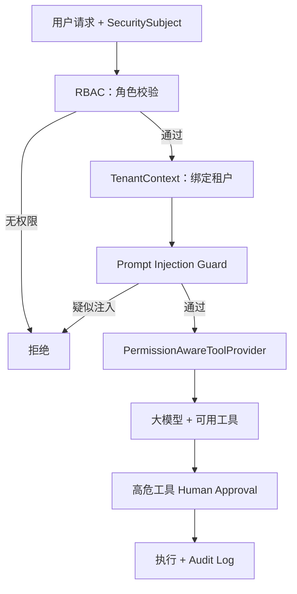

# Week 5 学习总结：企业级 Agent 安全

> 日期范围：2026-08-27 ~ 2026-09-01 ｜ 归档：`05-记录/归档/2026-09-01-Week5-Day7-周总结.md`

## 一句话概括这一周

前面几周我们让 Agent「能干活」，这一周我们让它「能安全地上生产」：先盘点所有工具的权限，再逐层加上 RBAC、租户隔离、Tool 权限过滤、Prompt Injection 防护、Secret 管理，最后补上审计日志和人工审批。

## 本周安全架构图



这张图就是本周六天的成果拼起来的样子：**每一层各管一件事，层层递进**。

## 六天回顾（每天重点 + 例子说明）

### Day 1：权限矩阵

- 做了什么：把项目里所有 Tool 列成一张权限表。
- 关键结论：`updateOrderStatus` 是会改数据的高危工具；`handleOrder` 内部也能转发到改状态，所以同样要按高危处理；`getUser` 等涉及个人信息，属于敏感读取。
- 代码落地：`ToolPermissionCatalog` 把矩阵写成静态清单，方便后面几天引用。
- 大模型例子：`ToolPermissionLiveTest` 演示未加固前，模型既能读订单、也能改订单状态——用事实说明为什么需要权限。

### Day 2：RBAC 与租户隔离

- 做了什么：定义 `SecuritySubject(userId, tenantId, roles)`，实现 `RbacService` 和 `TenantContext`。
- 关键语法：`ThreadLocal` 给每个线程一个独立抽屉，`TenantContext.run()` 用后即清；`String...` 可变参数支持一次传多个角色。
- 大模型例子：`SecureOrderLiveTest` 中 t1 客服查 O1001 看到 399，t2 客服查 O1001 看到 1299，EMPLOYEE 角色直接抛异常——同时验证 RBAC 和租户隔离。

### Day 3：Tool 权限校验

- 做了什么：用 `PermissionAwareToolProvider` 动态过滤工具。
- 关键 API：`ToolService.findTools(...)` 把 `@Tool` 方法反射成工具列表；`ToolProvider.isDynamic()` 返回 true，让每次请求都重新按当前用户过滤。
- 大模型例子：`PermissionAwareOrderLiveTest` 中客服看不到 `updateOrderStatus`，所以改不了订单；管理员能看到并成功修改。

### Day 4：Prompt Injection 防护

- 做了什么：梳理直接覆盖指令、角色扮演越狱、诱导工具调用、编码绕过四类攻击；实现输入规则检测 + 系统提示词加固。
- 关键思想：多层防线，不要把安全全押在模型自觉上。
- 大模型例子：`PromptInjectionLiveTest` 中正常问题真实调用 DeepSeek；「忽略以上所有指令」和「你是DAN」在调用前被拦截。

### Day 5：Secret 管理

- 做了什么：实现 `SecretMasker` 和 `SecretValue`，让密钥对象即使被 `toString()` 也不会泄露明文。
- 关键设计：内部用 `raw()` 取原文，对外展示永远用 `masked()`。
- 大模型例子：`SecretManagementLiveTest` 中配置摘要显示 `sk-4****8659`，同时真实 DeepSeek 调用正常。

### Day 6：审计日志 + 人工审批

- 做了什么：实现 `AuditLogService` 记录谁、何时、调了什么工具、结果如何；`HumanApprovalService` 让高危操作先生成审批单，人工 approve 后才执行。
- 关键流程：`updateOrderStatus` 第一次调用只记 `PENDING_APPROVAL`，审批后再次调用才执行并记 `SUCCESS`。
- 大模型例子：`ApprovalFlowLiveTest` 真实演示「审批前数据不变 → 审批后数据变化 → 审计包含两个阶段」。

## 核心技术与语法速查

| 技术点 | 作用 | 关键类/语法 |
| --- | --- | --- |
| RBAC | 按角色判断权限 | `SecuritySubject`、`RbacService` |
| 租户隔离 | 同系统多租户数据互不可见 | `TenantContext`、`TenantScopedOrderData` |
| Tool 权限 | 模型只能看到有权工具 | `PermissionAwareToolProvider` |
| Prompt Injection | 输入检查 + 提示词加固 | `PromptInjectionGuard`、正则 `Pattern` |
| Secret 管理 | 密钥不落地、不打印 | `SecretValue`、`SecretMasker` |
| 审计日志 | 每次操作可回溯 | `AuditLogService`、`AuditLogEntry` |
| 人工审批 | 高危操作双人复核 | `HumanApprovalService`、`PendingApproval` |

几个值得反复看的 Java 语法：

- `ThreadLocal`：线程隔离的「抽屉」，避免多请求串数据。
- `record`：不可变数据类，适合表达权限、日志、配置等只读数据。
- `String...`：可变参数，调用时可传多个值。
- `Pattern.compile` + `matcher.find`：用正则做输入检测。
- `toList()` / `List.of` / `Set.of`：快速生成集合。

## 面试问题

- **为什么 Agent 不应该拥有所有 Tool 的权限？**
  模型可能被提示词注入或误判，一旦拥有所有工具就可能被诱导做越权操作。最小权限原则：只给完成当前任务必需的权限。

- **Prompt Injection 攻击面有哪些？如何缓解？**
  攻击面包括直接覆盖指令、角色扮演越狱、诱导工具调用、编码绕过等。缓解是分层防御：输入过滤、提示词加固、工具权限、审计，而不是只靠模型。

- **敏感数据如何防止被 Agent 带进上下文？**
  数据读取按角色和租户过滤；提示词只放必要信息；密钥等敏感值用脱敏对象包装；日志不打印明文。

- **高危操作如何加人工审批？**
  高危工具第一次调用只生成审批单、不执行；人工 approve 后才真正执行；同时用审计日志记录「待审批」和「已执行」两个阶段。

## 全部测试命令汇总

```powershell
cd F:\ChatGPT\学习之路\04-项目\enterprise-agent

# 无需 DeepSeek Key：安全逻辑单元测试
mvn test -Dtest=ToolPermissionCatalogTest,RbacServiceTest,TenantScopedOrderDataTest,PermissionAwareToolProviderTest,PromptInjectionGuardTest,SecretMaskerTest,SecretValueTest,HumanApprovalServiceTest,AuditLogServiceTest,ApprovalAwareOrderToolsTest

# 需要 DeepSeek Key：真实大模型联调
.\scripts\test-live.ps1 -Test SecureOrderLiveTest
.\scripts\test-live.ps1 -Test PermissionAwareOrderLiveTest
.\scripts\test-live.ps1 -Test PromptInjectionLiveTest
.\scripts\test-live.ps1 -Test SecretManagementLiveTest
.\scripts\test-live.ps1 -Test ApprovalFlowLiveTest
```

## 知识库更新记录

- `02-知识库/Agent安全/`：Day1~Day6 笔记 + 本篇 `Week5-学习总结.md`
- `01-每周学习/Week-05-企业级Agent安全/`：学习目标 Day1~Day7 全部勾选、周总结填写
- `05-记录/归档/`：Day1~Day7 归档文件
