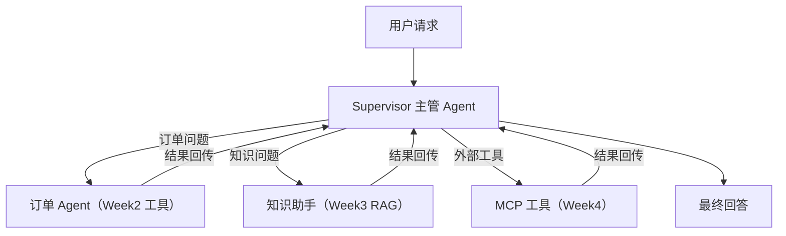
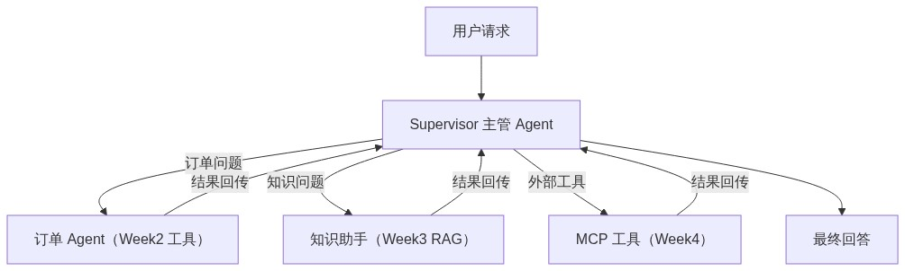

# Day 1：Agent Orchestration 模式 + 本项目编排图

> Week 4 ｜ 归档：`05-记录/归档/2026-08-23-Week4-Day1-Orchestration.md` ｜ 参考：LangChain4j Agents 文档、LLM Agents 综述论文（arXiv:2309.07864）

## 一、从 Single-Agent 到 Multi-Agent

- **Single-Agent**：一个 Agent 拥有所有工具，自己判断调用什么（Week 2 的订单 Agent 就是）。
- **Multi-Agent**：把任务拆给多个专职 Agent，再由一个「主管（Supervisor）」或流程编排它们。

先想清楚：**Multi-Agent 不一定更好**。Agent 越多，上下文传递、延迟、成本、失败点都越多。只有任务确实需要「不同角色/不同工具/并行」时才有价值。

## 二、四种常见编排模式

| 模式 | 说明 | 适用 |
| --- | --- | --- |
| Supervisor（主管） | 主 Agent 根据意图把任务分派给子 Agent | 意图多样、需要路由 |
| Handoff（交接） | 一个 Agent 把对话上下文交给另一个继续 | 转人工/跨角色接力 |
| Sequential（串行） | A → B → C 固定流水线 | 步骤依赖明确 |
| Parallel（并行） | 多个 Agent 同时处理，再合并结果 | 独立子任务可提速 |

另外两种控制流：

- **Conditional（条件分支）**：按某个条件决定走哪条路（类似 if-else）。
- **Agent State（状态传递）**：多个 Agent 之间共享/传递状态，避免每个 Agent 从头开始。

## 三、本项目编排图

- **Supervisor**：负责「看懂用户意图 → 分派给正确的子 Agent → 汇总结果回答」。
- **订单 Agent**：复用 Week 2 的 `OrderTools`（查订单/改状态）。
- **知识助手**：复用 Week 3 的 RAG（检索企业文档回答）。
- **MCP 工具**：本周后半段接入的外部工具（Day 2~4）。

## 四、何时用 / 不用 Multi-Agent（面试要点）

- ✅ 该用：意图明显分几类（订单/知识/工具）、子任务可并行、每个角色工具集不同、需要交接上下文。
- ❌ 不该用：单一工具集就能搞定、任务简单、上下文必须高度一致——此时 Single-Agent 更便宜也更稳。

## 五、Day 1 完成标准

- [x] 理解 Supervisor / Handoff / Sequential / Parallel / Conditional / Agent State
- [x] 画出本项目编排架构图