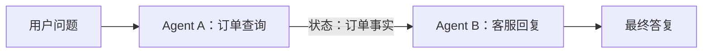

# Day 6：多 Agent 状态传递与结果合并

> Week 4 ｜ 归档：`05-记录/归档/2026-08-26-Week4-Day6-多Agent状态传递与结果合并.md` ｜ 代码：`com.enterprise.agent.multiagent`

## 一、先讲人话：这是在解决什么

Day 5 的 Supervisor 像一个「前台总机」，它只做一件事：听清问题，然后转给一个部门，拿到结果就回话。这个模式很好，但它有个明显的限制：

- 一次只让**一个**子 Agent 干活；
- 两个子 Agent 之间**不聊天**，前面的成果不会自动传给后面；
- 如果需要「先查订单，再把订单信息润色成客服话术」，总机就有点吃力。

Day 6 要解决的，就是这类「流水线」问题：

1. 第一个 Agent 先查数据，产出一段结果；
2. 这段结果要作为**状态**传给第二个 Agent；
3. 第二个 Agent 基于这个状态，再加工成最终答案。

用工厂流水线类比最好理解：

- **Agent A = 前道工序**：把原料加工成半成品（查出订单事实）。
- **状态 = 传送带上的半成品**：前道工序做完，把半成品放上传送带。
- **Agent B = 后道工序**：从传送带取下这个半成品，做精加工（润色成客服话术）。

这里的「传送带」，就是两个 Agent 之间的**共享状态**。

## 二、本项目的最小可运行例子

我们不虚构一个复杂系统，直接用现有的能力搭一条最短流水线：



- Agent A 复用 Week 2 的 `OrderAgentService`：它内部会调用 `getOrder` 等真实工具，返回一段自然语言结果。
- Agent B 是新增的 `CustomerReplyService`：它不查数据库，只接收 Agent A 的结果，让大模型把它润色成客服话术。

### 第 1 步：定义 Agent B 的提示词模板

```java
public interface CustomerReplyAssistant {

    @SystemMessage("""
            你是企业客服回访专员。你收到的「订单事实」来自订单查询 Agent，不要怀疑或篡改事实。
            你的任务是把订单事实合并、润色成一段自然、得体的客服回复。""")
    @UserMessage("""
            用户原问题：{{question}}

            订单查询 Agent 返回的事实：
            {{orderFacts}}

            请生成最终回复，并务必保留订单号、金额、商品名称等关键事实，不要省略。""")
    String compose(@V("question") String question, @V("orderFacts") String orderFacts);
}
```

这里有两个新语法，值得停下来看清楚：

- `@UserMessage` 写在**方法上**时，它的内容是「消息模板」；`{{question}}` 和 `{{orderFacts}}` 是占位符。
- 方法参数上的 `@V("question")` 负责把 Java 参数值填进模板对应位置。`@V` 的意思是 **Variable**。

所以最终发给大模型的消息会被 LangChain4j 自动拼成：

```text
用户原问题：查询订单 O1001 的信息

订单查询 Agent 返回的事实：
订单 O1001：用户 U1，商品 P1，金额 399.0 元，状态 PAID
```

### 第 2 步：用 AiServices 把 Agent B 组装起来

```java
@Service
public class CustomerReplyService {

    private final CustomerReplyAssistant assistant;

    public CustomerReplyService(@Qualifier("openAiChatModel") OpenAiChatModel chatModel) {
        this.assistant = AiServices.builder(CustomerReplyAssistant.class)
                .chatModel(chatModel)
                .build();
    }

    public String compose(String question, String orderFacts) {
        return assistant.compose(question, orderFacts);
    }
}
```

注意 Agent B 这里**没有 `.tools(...)`**，因为它不需要工具，只需要大模型做「文字加工」。

### 第 3 步：用一个编排器把两个 Agent 串起来

```java
@Service
public class MultiAgentCoordinatorService {

    private final OrderAgentService orderAgentService;
    private final CustomerReplyService customerReplyService;

    public MultiAgentCoordinatorService(OrderAgentService orderAgentService,
                                        CustomerReplyService customerReplyService) {
        this.orderAgentService = orderAgentService;
        this.customerReplyService = customerReplyService;
    }

    public String handleCustomerQuestion(String question) {
        // 第一步：Agent A 产出「订单事实」，这就是要传递的状态
        String orderFacts = orderAgentService.chat(question);

        // 第二步：把状态交给 Agent B，完成结果合并
        return customerReplyService.compose(question, orderFacts);
    }
}
```

整个编排就三行核心逻辑，但已经完整体现了：

- **状态传递**：`orderFacts` 从 Agent A 的输出流到 Agent B 的输入。
- **结果合并**：Agent B 把「用户问题 + 订单事实」合并成一个最终答复。

## 三、为什么不能只靠一个 Agent 做完

你可能会问：「让订单 Agent 直接说客服话术不就行了？」当然可以，很多场景一个 Agent 就够了。Day 6 的意义在于给你**多一个组织复杂流程的选择**：

- 订单 Agent 的职责是「查得准」，客服 Agent 的职责是「说得漂亮」，两者关注点不同。
- 分开后可以独立调提示词、独立测试、独立替换：以后想把「客服话术」换成「风险审核」，只换 Agent B 即可。
- 当中间状态还要给第三个 Agent 用时（比如再交给「法务审查 Agent」），流水线结构会自然扩展。

一句话：**Single-Agent 不是不能用，Multi-Agent 是用来解决「一个 Agent 职责太杂、流程太长」的问题。**

## 四、验证：必须让真实大模型跑一遍

### 1. 单元测试（不调大模型，验证状态确实传过去了）

`MultiAgentCoordinatorServiceTest` 用 Mockito 把两个子 Agent 都替身，只验证编排器有没有把第一个 Agent 的输出原样传给第二个 Agent：

```java
when(orderAgentService.chat(question)).thenReturn(orderFacts);
when(customerReplyService.compose(question, orderFacts)).thenReturn("您好，订单 O1001 金额为 399.0 元。");

String reply = coordinator.handleCustomerQuestion(question);

verify(orderAgentService).chat(question);
verify(customerReplyService).compose(question, orderFacts);
```

这保证「传送带」不会把半成品传丢。

### 2. 真实 DeepSeek 联调

`MultiAgentLiveTest` 里两个 Agent 都是真的：

- Agent A 真实调用 `OrderTools.getOrder` 查数据；
- Agent B 真实调用 DeepSeek 做润色。

最终回复必须同时出现 `O1001` 和 `399`。`399` 是订单工具返回的，不可能被模型凭空编出来，所以它能证明**状态从 Agent A 传到了 Agent B**。

### 如何本地测试

```powershell
cd F:\ChatGPT\学习之路\04-项目\enterprise-agent

# 1) 不调大模型，只验证状态传递逻辑
mvn test -Dtest=MultiAgentCoordinatorServiceTest

# 2) 真实 DeepSeek 联调
.\scripts\test-live.ps1 -Test MultiAgentLiveTest
```

IDEA 里直接右键 `MultiAgentLiveTest` Run，记得在 Run Configuration 的 Environment variables 配 `DEEPSEEK_API_KEY`。

## 五、Day 6 完成标准

- [x] 实现多 Agent 状态传递：Agent A 的产出传给 Agent B
- [x] 实现结果合并：Agent B 基于状态生成最终答案
- [x] 有真实调用大模型的联调例子（`MultiAgentLiveTest`）
