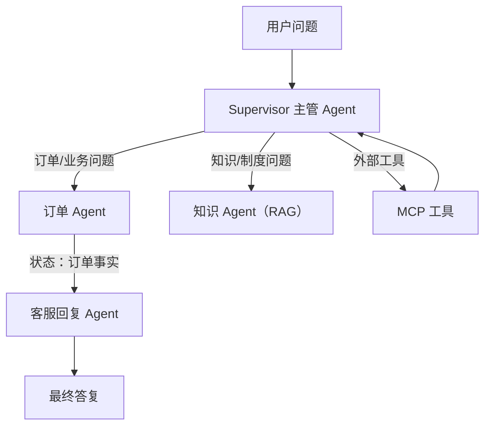

# Week 4 学习总结：Agent 编排 + MCP

> 日期范围：2026-08-23 ~ 2026-08-27 ｜ 归档：`05-记录/归档/2026-08-27-Week4-Day7-周总结.md`

## 一句话概括这一周

前几周我们学会了「让一个 Agent 用工具」，这一周我们学会「让多个 Agent 协作、并且把工具用 MCP 标准化」。核心就两条主线：

1. **Agent 编排**：Supervisor 分派、多 Agent 状态传递与结果合并。
2. **MCP**：把工具从「LangChain4j 专属」变成「跨语言、跨应用通用的标准接口」。

## 本周全景图



- 上半部分是 Week 2/3 已有的能力，下半部分 `MCP` 和 `客服回复 Agent` 是本周新增。
- 虚线可以理解为：MCP 工具也可以被订单 Agent 使用；客服回复 Agent 则是多 Agent 串行的第二个环节。

## 六天回顾（每天的重点 + 例子 + 怎么测）

### Day 1：Agent Orchestration 模式

**解决的问题**：一个 Agent 干所有事会越来越臃肿，需要学会「怎么拆、怎么协调」。

**学到的四种模式**：

| 模式 | 一句话解释 | 适合什么时候 |
| --- | --- | --- |
| Supervisor | 主管负责分派 | 意图多样、需要路由 |
| Handoff | 一个 Agent 把上下文交给下一个 | 转人工、跨角色接力 |
| Sequential | A → B → C 固定流水线 | 步骤有先后依赖 |
| Parallel | 多个 Agent 同时做，最后合并 | 子任务独立、想提速 |

还学了两个控制流：**Conditional（条件分支）** 和 **Agent State（状态传递）**。其中 Agent State 是 Day 6 的重点。

**重要判断**：Multi-Agent 不一定比 Single-Agent 好。Agent 越多，上下文传递、成本、失败点也越多；只有任务确实需要不同角色/不同工具/并行时才值得拆。

**怎么复习**：看 `02-知识库/Agent编排/Day1-Orchestration模式.md` 里的编排图；不需要跑代码。

### Day 2：MCP 协议 + 跑通一个 MCP Server

**解决的问题**：`@Tool` 只能给 LangChain4j 用，别的团队/别的语言接不了。MCP 把工具变成「USB-C」一样的标准接口。

**核心类比**：`N 个模型 × M 个工具 = N×M 种对接`，改成 MCP 后变成 `N + M`——每个模型实现一次 Client，每个工具实现一次 Server，就能任意组合。

**关键例子：`SimpleMcpServer` 的 add 工具**

```java
McpSyncServer server = McpServer.sync(transport)
        .serverInfo("enterprise-tools", "1.0.0")
        .toolCall(addTool(), this::add)
        .build();
```

这段代码要这样读：

- `McpServer.sync(transport)`：用某个传输方式创建一个同步 Server。
- `.serverInfo(...)`：自我介绍「我是谁、什么版本」。
- `.toolCall(工具说明书, 处理函数)`：注册一个工具。说明书给模型看，处理函数真正干活。
- `.build()`：把前面配置真正组装成 Server。

工具说明书的核心是 JSON Schema，它告诉模型「这个工具有哪些参数、分别是什么类型、哪些必填」：

```java
McpSchema.Tool.builder("add")
        .description("计算两个数字之和")
        .inputSchema(McpSchema.JsonSchema.builder()
                .type("object")
                .properties(Map.of("a", Map.of("type", "number"),
                                   "b", Map.of("type", "number")))
                .required(List.of("a", "b"))
                .build())
        .build();
```

处理函数负责「读参数 → 干活 → 包结果」：

```java
private McpSchema.CallToolResult add(McpSyncServerExchange exchange,
                                     McpSchema.CallToolRequest request) {
    int a = ((Number) request.arguments().get("a")).intValue();
    int b = ((Number) request.arguments().get("b")).intValue();
    return McpSchema.CallToolResult.builder(
            List.of(new McpSchema.TextContent(String.valueOf(a + b)))).build();
}
```

**怎么测**：`mvn test -Dtest=SimpleMcpServerTest`。Day 2 只在同一进程里验证 Server 能注册工具、工具逻辑正确；真正的跨进程调用放 Day 3/4。

### Day 3：接入 MCP Client

**解决的问题**：Server 有了，Agent 怎么发现并调用它。

**三个关键组件**：

| 组件 | 作用 | 关键类 |
| --- | --- | --- |
| McpClient | 客户端，负责列工具、调工具 | `DefaultMcpClient` |
| Transport | 用哪种方式连 Server（stdio/http/websocket） | `StdioMcpTransport` |
| McpToolProvider | 把 MCP 工具翻译给 AiServices 用 | `McpToolProvider.builder()` |

**关键例子**：

```java
McpTransport transport = StdioMcpTransport.builder()
        .command(List.of("java", "-jar", "mcp-server.jar"))
        .build();

McpClient mcpClient = DefaultMcpClient.builder()
        .transport(transport)
        .build();

McpToolProvider toolProvider = McpToolProvider.builder()
        .mcpClients(List.of(mcpClient))
        .build();
```

`McpToolProvider` 实现了 LangChain4j 的 `ToolProvider`，所以能像普通 `@Tool` 一样塞进 `AiServices.tools(...)`。Agent 使用时并不知道工具来自 MCP 还是本地。

**怎么测**：`mvn test -Dtest=McpToolProviderTest`。Day 3 是「接线验证」；真实跨进程往返在 Day 4 完成。

### Day 4：把现有 Tool 改造成 MCP Tool

**解决的问题**：把 Week 2 的 `OrderTools.getOrder` 暴露成 MCP 工具，同时让大模型真的通过 MCP 调用它。

**核心思路**：业务逻辑一个字不改，只把「LangChain4j 的说明方式」翻译成「MCP 的说明方式」。

| 信息 | @Tool 写法 | MCP Tool 写法 |
| --- | --- | --- |
| 工具名 | 方法名 `getOrder` | `Tool.builder("getOrder")` |
| 描述 | `@Tool("根据订单号查询订单信息")` | `.description("根据订单号查询订单信息")` |
| 参数说明 | `@P("订单号，例如 O1001")` | JSON Schema 的 `properties` |
| 谁执行 | 方法本体 | handler 里调同一个方法 |

**真实 stdio 联调的关键**：测试代码里有一个 `startOrderMcpServer()`，它会拼出一条 `java -cp <classpath> com.enterprise.agent.mcp.OrderMcpServer` 命令，交给 `StdioMcpTransport` 去启动一个 Server 子进程；`resolveClasspath()` 负责告诉这个新 JVM 去哪里找代码和依赖。所以测试运行时你不需要手动启动 Server。

**两个非常值得记住的坑**：

- stdout 只能传输 JSON-RPC，日志要切到 stderr，否则协议流被日志污染，客户端会报 `Ignoring message received because it is not valid JSON`。
- Server 的 `main()` 不能 `join()` 死等，否则客户端 `close()` 会「关流等进程退出 / 进程等流关闭」互相卡死。

**怎么测**：

```powershell
mvn test -Dtest=OrderMcpServerStdioTest          # 不开大模型，验证真实 stdio 链路
.\scripts\test-live.ps1 -Test McpOrderLiveTest    # 真实 DeepSeek 通过 MCP 查订单
```

`McpOrderLiveTest` 的回复里必须出现 `399`，而 `399` 只能来自 `getOrder`，证明模型真的走了 MCP 协议。

### Day 5：Supervisor 模式

**解决的问题**：系统里有订单 Agent 和知识 Agent 两类能力，需要一个「前台总机」按问题类型分派。

**关键例子：把子 Agent 包装成工具**

```java
@Tool("处理订单、用户、商品、物流、修改订单状态等业务问题")
public String handleOrder(@P("用户的业务问题") String question) {
    return orderAgentService.chat(question);
}
```

这里有个容易忽略但很重要的点：**子助手本身也是 Agent**，但它在 Supervisor 眼里只是一个 `@Tool`。子助手内部再调工具、再跑 RAG，上层不关心。

**总机的分诊规则写在 `@SystemMessage` 里**：

```java
@SystemMessage("""
        你是企业 AI 助手的总调度员。
        - 订单、用户、商品、物流 → 调用 handleOrder
        - 公司制度、文档、知识问答 → 调用 handleKnowledge
        然后基于子助手返回的结果，用中文简洁回答。""")
```

**怎么测**：

```powershell
mvn test -Dtest=SupervisorToolsTest
.\scripts\test-live.ps1 -Test SupervisorLiveTest
```

`SupervisorLiveTest` 问「查询订单 O1001」，总机自动转订单部，回复带出 O1001 和 399。

### Day 6：多 Agent 状态传递与结果合并

**解决的问题**：Supervisor 一次只让一个子 Agent 干活，前面的结果不会自动传给后面。Day 6 搭一条「A 查数据 → 状态传给 B → B 合并成最终答案」的流水线。

**流水线类比**：Agent A 是前道工序，产出的「订单事实」像传送带上的半成品；Agent B 是后道工序，从传送带取下这个半成品做精加工。

**关键例子：Agent B 用模板接收状态**

```java
@UserMessage("""
        用户原问题：{{question}}

        订单查询 Agent 返回的事实：
        {{orderFacts}}

        请生成最终回复，并务必保留订单号、金额、商品名称等关键事实。""")
String compose(@V("question") String question, @V("orderFacts") String orderFacts);
```

- 方法上的 `@UserMessage` 是「消息模板」；`{{question}}`、`{{orderFacts}}` 是占位符。
- 参数上的 `@V("question")` 把 Java 参数填进对应占位符，`@V` 是 Variable 的意思。

**编排器只有三行核心逻辑**：

```java
String orderFacts = orderAgentService.chat(question);          // A 产出状态
return customerReplyService.compose(question, orderFacts);      // B 接收状态并合并
```

**怎么测**：

```powershell
mvn test -Dtest=MultiAgentCoordinatorServiceTest
.\scripts\test-live.ps1 -Test MultiAgentLiveTest
```

`MultiAgentLiveTest` 的最终回复必须同时出现 `O1001` 和 `399`，证明订单 Agent 的状态真的传给了客服回复 Agent。

## 本周新语法 / 关键技术速查

| 语法 / API | 作用 | 例子 |
| --- | --- | --- |
| `@Tool` / `@P` | 把方法变成工具、描述参数 | `@Tool("查订单") String getOrder(@P("订单号") String id)` |
| `@SystemMessage` | 给 Agent 一个角色和规则 | `@SystemMessage("你是客服")` |
| `@UserMessage`（方法级） | 定义用户消息模板 | `@UserMessage("问题：{{question}}")` |
| `@V` | 把 Java 参数填进模板占位符 | `@V("question") String question` |
| `AiServices.builder(...)` | 组装一个 Agent | `.chatModel(model).tools(tools).build()` |
| `McpServer.sync(transport)` | 创建 MCP Server | `.toolCall(tool, handler).build()` |
| `McpToolProvider` | 把 MCP 工具桥接给 AiServices | `.mcpClients(client).build()` |
| `StdioMcpTransport` | 用子进程 stdin/stdout 连 Server | `.command(List.of("java", "-jar", "x.jar"))` |
| JSON Schema Builder | 描述工具入参 | `.type("object").properties(...).required(...)` |
| Lambda / 方法引用 | 写 handler 的简洁写法 | `this::add` 等价于 `(ex, req) -> add(ex, req)` |
| `Map.of` / `List.of` | 快速建不可变集合 | `Map.of("a", 1)`、`List.of("x")` |
| `record` | 不可变数据类，免写 getter/setter | `record User(String id, String name) {}` |

## 面试重点（把这一周的话说清楚）

- **Multi-Agent 一定比 Single-Agent 好吗？**
  不是。Multi-Agent 解决的是「职责太杂、需要不同工具集、需要并行/接力」的问题；简单任务用 Single-Agent 更便宜、更稳。不要为了多 Agent 而多 Agent。

- **MCP 什么时候该用、什么时候不该用？**
  工具要跨多个 AI 应用复用、团队要统一管理工具集、需要 Resources/Prompts 标准化时用；只给自己一个应用、工具很少时直接写 `@Tool` 更简单。

- **MCP 基于 JSON-RPC，和普通 REST Tool 的区别？**
  REST Tool 通常是一个一个接口各写各的；MCP 是带生命周期和标准能力协商的协议，Client 能自动发现 Server 的 Tools/Resources/Prompts，工具接入更统一、更可迁移。

## 全部测试命令汇总

```powershell
cd F:\ChatGPT\学习之路\04-项目\enterprise-agent

# 无需 DeepSeek Key：Server/Client/编排底层验证
mvn test -Dtest=SimpleMcpServerTest,McpToolProviderTest,InMemoryMcpClientTest,OrderMcpServerTest,OrderMcpServerStdioTest,SupervisorToolsTest,MultiAgentCoordinatorServiceTest

# 需要 DeepSeek Key：真实大模型联调
.\scripts\test-live.ps1 -Test McpOrderLiveTest
.\scripts\test-live.ps1 -Test SupervisorLiveTest
.\scripts\test-live.ps1 -Test MultiAgentLiveTest
```

## 知识库更新记录

- `02-知识库/Agent编排/`：Day1、Day5、Day6 笔记 + 本篇 `Week4-学习总结.md`
- `02-知识库/MCP/`：Day2、Day3、Day4 笔记
- `01-每周学习/Week-04-Agent编排与MCP/学习目标.md`：Day1~Day7 全部勾选
- `05-记录/归档/`：Day1~Day7 归档文件
