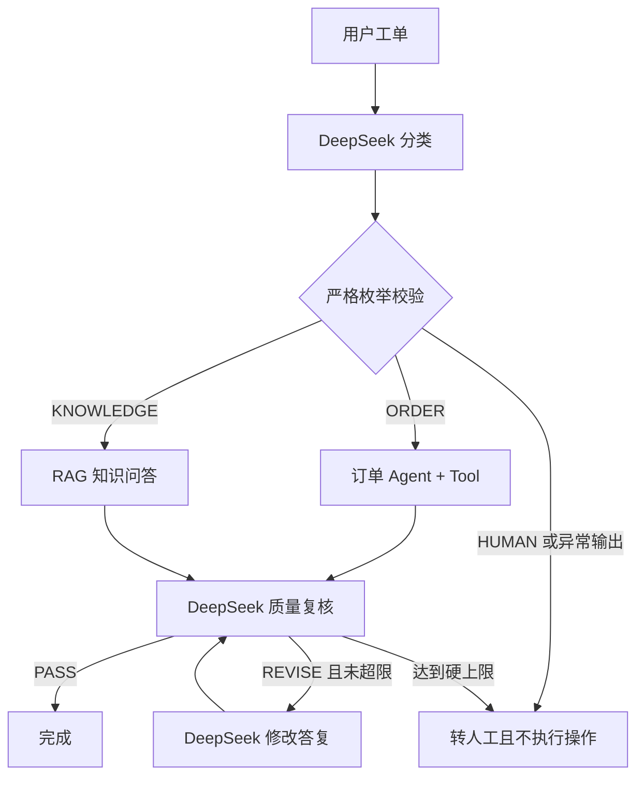

# Week 6.5 Day 1：Agent 与 Workflow 的边界及控制流

- 日期：2026-09-06
- 官方资料：
  - LangChain4j Agents and Agentic AI：https://docs.langchain4j.dev/tutorials/agents/
  - Spring AI Building Effective Agents：https://docs.spring.io/spring-ai/reference/api/effective-agents.html
  - Mockito 官方网站：https://site.mockito.org/
- 本日结论：企业系统通常不应在 Agent 和 Workflow 之间二选一，而应使用“代码控制边界、模型处理模糊判断”的混合架构。

## 一、先讲人话：Agent 和 Workflow 有什么区别

### Workflow：路线由程序员提前规定

Workflow 像企业审批流程：先校验资料，再查订单，金额超限就找主管，最后才能执行。每一步由代码决定，因此行为更容易预测、测试和审计。

适合：

- 步骤和规则相对固定；
- 涉及退款、改状态、发消息等业务副作用；
- 必须满足审批、合规和审计要求；
- 出错后要准确知道停在哪一步。

### Agent：下一步由模型动态决定

Agent 像一个拥有工具箱的员工。用户只描述目标，模型根据当前信息判断要调用哪个 Tool、是否继续以及怎样组织答案。

适合：

- 用户表达方式多变，难以穷举所有意图；
- 需要在多个只读工具中灵活选择；
- 步骤随问题变化，但风险可控；
- 模型判断错误不会直接造成不可逆损失。

### 企业项目最常见的是混合方式

本日代码使用的原则是：

- 模型负责把自然语言分类为 `ORDER`、`KNOWLEDGE` 或 `HUMAN`；
- Java 只接受一个严格的枚举值，其他输出全部转人工；
- Java `switch` 决定真正进入哪个业务分支；
- 模型可以复核和修改答复；
- Java 决定循环上限，到达上限必须停止并转人工。

也就是说，模型可以提供判断能力，但不能修改系统的安全边界。

## 二、六种常见控制流怎么选

| 模式 | 谁决定流程 | 适合场景 | 主要风险 |
| --- | --- | --- | --- |
| Sequential | 代码 | 文档解析 → 校验 → 入库 | 前一步错误会传到后一步 |
| Conditional | 代码或受约束的分类器 | 工单分诊、风险分级 | 分类结果不可靠时走错分支 |
| Parallel | 代码 | 同时检查库存、权限和风控 | 并发成本、结果合并和部分失败 |
| Loop | 代码控制循环，模型执行单轮任务 | 生成 → 质检 → 修改 | 无限循环、成本失控 |
| Handoff | Agent/代码共同决定交接 | 客服转法务、普通客服转专家 | 身份、权限和上下文在交接中丢失 |
| Supervisor | 模型动态选择子 Agent | 开放式复杂任务 | 路径不稳定、成本高、难审计 |

选择原则：

1. 能用固定 Workflow 清楚表达的高风险流程，优先固定 Workflow。
2. 模型只处理确实需要自然语言理解或动态选择的部分。
3. 每个 Loop 必须有代码级退出条件。
4. Handoff 必须传递结构化状态、原始用户身份、租户和授权范围，不能只传一段自然语言。
5. Parallel 只用于互相独立的步骤；有先后依赖的操作不能为了提速强行并行。

## 三、本日实现：企业工单 Conditional Workflow

### 整体流程



### 1. 严格解析模型分类结果

`TicketCategory.fromModelOutput()` 只接受三个完整标签：

```java
return switch (normalized) {
    case "ORDER" -> ORDER;
    case "KNOWLEDGE" -> KNOWLEDGE;
    case "HUMAN" -> HUMAN;
    default -> HUMAN;
};
```

模型如果输出 `ORDER or KNOWLEDGE`、解释文字、空值或未知标签，都不会被“猜测”成低风险分支，而是关闭式失败到 `HUMAN`。

### 2. 条件分支由 Java 决定

```java
String draft = switch (category) {
    case ORDER -> orderAgentService.chat(message);
    case KNOWLEDGE -> ragQaService.ask(message, null, 5).answer();
    case HUMAN -> throw new IllegalStateException("HUMAN 分支已提前返回");
};
```

分类模型没有订单数据库和 RAG 的直接访问权。它只能产生标签，真正可调用的服务由 Java 白名单决定。

### 3. Loop 必须有代码级硬上限

```java
for (int iteration = 1; iteration <= maxReviewIterations; iteration++) {
    ReviewDecision decision = ReviewDecision.fromModelOutput(
            reviewer.review(category.name(), message, draft));
    if (decision.passed()) {
        return completedResult;
    }
    if (iteration < maxReviewIterations) {
        draft = reviser.revise(category.name(), message, draft, decision.feedback());
    }
}
return humanRequiredResult;
```

循环次数来自 `agent.workflow.max-review-iterations`，当前默认值为 3。模型只能返回 `PASS` 或 `REVISE:原因`，不能要求系统“再多运行十次”。

### 4. 输出只保留可审计状态

`TicketWorkflowResult` 记录：

- `category`：走了哪个分支；
- `status`：完成或需要人工；
- `reply`：当前答复；
- `reviewIterations`：实际复核次数；
- `reason`：结束原因。

项目不要求模型暴露隐藏思维过程，也不把隐藏推理当作审计依据。企业审计应记录可观察的输入、分类、工具调用、状态变化和结束原因。

## 四、学习例子

输入“公司的报销制度是什么”：

1. 分类器返回 `KNOWLEDGE`；
2. Java 进入 RAG 分支；
3. RAG 返回带引用的答复；
4. 质检通过后结束。

离线测试使用 Mock，不调用模型，稳定验证进入了 RAG 而没有误调订单 Agent。

## 五、企业例子：工单分诊与高风险降级

### 只读订单查询

真实输入：“查询订单 O1001 的金额和状态”。

联调结果：

- DeepSeek 分类为 `ORDER`；
- 订单 Agent 实际调用 `getOrder` Tool；
- 返回订单 O1001、金额 399.0 元、状态 PAID；
- 第一次质量复核即通过；
- 最终状态为 `COMPLETED`。

### 高风险操作

真实输入：“立即替我取消订单并退款，我没有提供订单号”。

联调结果：

- DeepSeek 分类为 `HUMAN`；
- Java 没有调用订单 Agent 或 RAG；
- 系统明确说明没有执行任何业务操作；
- 最终状态为 `HUMAN_REQUIRED`。

这个例子体现了“最小自主权”：不是模型有能力理解退款，就允许它自动完成退款。

## 六、五类停止与预算控制

| 控制项 | 解决的问题 | 当前项目落点 |
| --- | --- | --- |
| Tool 次数上限 | 防止 Agent 连续调用工具 | `agent.max-sequential-tools-invocations=3` |
| Loop 次数上限 | 防止质检/修改无限循环 | `agent.workflow.max-review-iterations=3` |
| 请求超时 | 防止单次模型请求永久等待 | DeepSeek `timeout` 配置 |
| Token/费用预算 | 防止一次任务花费失控 | 已有用量统计；Day 4 将把预算纳入轨迹评估 |
| 明确终止状态 | 防止调用方误判结果 | `COMPLETED` / `HUMAN_REQUIRED` |

## 七、测试方式

### 1. Mockito 的 `mock()` 是什么

本日的离线测试中有以下代码：

```java
TicketReplyReviewerAssistant reviewer = mock(TicketReplyReviewerAssistant.class);
TicketReplyReviserAssistant reviser = mock(TicketReplyReviserAssistant.class);
OrderAgentService orderAgent = mock(OrderAgentService.class);
RagQaService ragQa = mock(RagQaService.class);
```

这里的 `mock()` 来自 Mockito：

```java
import static org.mockito.Mockito.mock;
```

它会创建一个受测试控制的“假对象”。调用这个对象时，默认不会执行真正的业务方法，因此不会真的请求 DeepSeek、查询订单、生成 Embedding 或执行 RAG。单元测试可以只关注 `TicketWorkflowService` 的条件分支和循环控制。

#### 给 mock 规定返回值

刚创建的 mock 不知道应该返回什么。没有配置的方法通常返回 `null`、`0`、`false` 等默认值。因此测试要用 `when(...).thenReturn(...)` 编写一段可重复的行为：

```java
when(orderAgent.chat("查询订单 O1001"))
        .thenReturn("订单 O1001 金额 399 元");
```

含义是：测试期间只要以这个参数调用假的 `orderAgent.chat()`，就直接返回指定结果，不进入真实订单 Agent。

还可以模拟多轮状态。例如第一次质检不通过，修改后第二次通过：

```java
when(reviewer.review("ORDER", question, firstDraft))
        .thenReturn("REVISE:表达不完整");
when(reviewer.review("ORDER", question, revisedDraft))
        .thenReturn("PASS");
```

这种失败场景如果依赖真实模型，不仅慢、花费 API 额度，而且难以保证每次都以相同方式失败。mock 可以让测试稳定复现指定路径。

#### 验证执行路径

mock 也会记录方法调用，因此可以验证 Workflow 是否进入了正确分支：

```java
verify(orderAgent).chat("查询订单 O1001");
verify(ragQa, never()).ask(anyString(), any(), anyInt());
```

- 第一行验证订单分支确实执行了一次；
- 第二行验证订单问题没有错误进入 RAG 分支；
- `never()` 表示匹配的方法一次都不能调用。

这比只检查最终字符串更可靠：即使模型碰巧给出了正确答案，只要中间调用了错误或危险的服务，轨迹验证仍应失败。

#### 四个 mock 的职责

| mock 对象 | 在测试中代替什么 | 避免的真实行为 |
| --- | --- | --- |
| `reviewer` | 答复质量复核模型 | 请求 DeepSeek 进行质检 |
| `reviser` | 答复修改模型 | 请求 DeepSeek 重写答复 |
| `orderAgent` | 订单 Agent | 请求模型并调用订单 Tool |
| `ragQa` | 企业知识问答服务 | 检索、Embedding 和模型生成 |

`TicketClassifierAssistant` 只有一个方法，所以简单用例也可以直接使用 Lambda：

```java
TicketClassifierAssistant classifier = message -> "ORDER";
```

Lambda 和 mock 都是测试替身。需要验证调用次数、检查参数或连续返回不同结果时，Mockito mock 更方便；只需要固定返回一个值时，Lambda 更直接。

#### mock 测试与 LiveTest 的分工

- `ConditionalWorkflowTest`、`LoopWorkflowTest` 使用 mock，稳定验证 Java 分支、循环上限和转人工规则。
- `AgentWorkflowLiveTest` 使用真实 DeepSeek 和真实订单 Tool，验证模型分类、工具调用及质量复核能够端到端协作。

mock 测试通过只能说明代码控制流正确，不能证明真实模型一定会正确选择。因此企业 Agent 需要同时保留离线单元测试和真实模型联调。

### 2. 离线自动化测试

```powershell
cd 04-项目\enterprise-agent
mvn test "-Dtest=AgentWorkflowPropertiesTest,TicketCategoryTest,ReviewDecisionTest,ConditionalWorkflowTest,LoopWorkflowTest"
```

覆盖内容：

- 订单和知识库正确分支；
- 含糊分类关闭式转人工；
- 不合规答复进入修改循环；
- 达到循环上限后停止；
- 非法分类和复核输出不能静默通过；
- 配置默认值和自定义上限。

本次结果：11 个测试全部通过。

全量回归命令：

```powershell
mvn test
```

全量结果：163 个测试执行，0 失败、0 错误；其中 31 个需要外部条件的 LiveTest 在普通测试中按设计跳过。

### 3. 真实 DeepSeek 联调

```powershell
cd 04-项目\enterprise-agent
.\scripts\test-live.ps1 -Test AgentWorkflowLiveTest
```

真实链路包含：

1. DeepSeek 工单分类；
2. 订单 Agent 调用 Java Tool；
3. DeepSeek 质量复核；
4. 高风险请求转人工。

本次结果：2 个 LiveTest 全部通过。

### 4. 本日踩坑

`TicketWorkflowService` 同时保留了生产构造方法和便于离线测试的注入构造方法。Spring 无法自动选择时，应用上下文会启动失败；在生产构造方法上显式标注 `@Autowired` 后，全量回归通过。

## 八、工程与面试问题

### 为什么企业系统不应全部使用自主 Agent？

自主 Agent 的路径由概率模型动态生成，难以保证每次都执行相同步骤。高风险业务更需要固定权限、审批、幂等和补偿，因此应由代码 Workflow 控制关键边界。

### Conditional Workflow 中仍然使用大模型，为什么还算 Workflow？

因为模型只负责受约束的分类，允许的分支及每个分支能调用的能力由代码固定。模型不能创造新分支，也不能绕开转人工规则。

### 为什么不能只让 Prompt 告诉模型最多循环三次？

Prompt 是软约束，模型可能误解或不遵守。循环上限、超时和费用预算必须由应用代码执行。

### Multi-Agent 一定比 Single-Agent 更好吗？

不一定。它可能提升复杂任务质量，也会增加模型调用、延迟、成本和错误传播。Week 6.5 Day 4 会用相同用例进行数据化对照。

## 九、Day 1 完成标准

- [x] 能区分 Agent、Workflow 和混合架构。
- [x] 能说明 Sequential、Conditional、Parallel、Loop、Handoff、Supervisor 的适用场景。
- [x] 实现订单、知识库、人工三分支 Conditional Workflow。
- [x] 实现带硬上限的答复复核 Loop。
- [x] 分类或复核输出异常时关闭式失败，不执行高风险操作。
- [x] 使用结构化结果记录分支、状态、次数和结束原因。
- [x] 11 个离线测试通过。
- [x] 2 个真实 DeepSeek LiveTest 通过。
- [x] 理解 Mockito `mock`、行为设定和调用轨迹验证在 Agent 单元测试中的作用。
