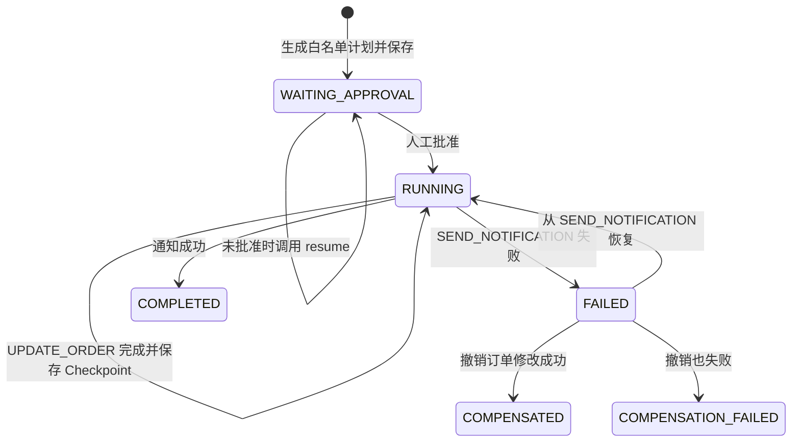

# Week 6.5 Day 2：Agent 持久化执行、恢复、幂等与补偿

- 日期：2026-09-08
- 官方资料：
  - LangChain4j Agents and Agentic AI：https://docs.langchain4j.dev/tutorials/agents/
  - Spring Integration Idempotent Receiver：https://docs.spring.io/spring-integration/reference/handler-advice/idempotent-receiver.html
  - Azure Compensating Transaction Pattern：https://learn.microsoft.com/azure/architecture/patterns/compensating-transaction
- 本日结论：Checkpoint 解决“从哪里继续”，幂等键解决“同一步会不会重复做”，补偿解决“前面已成功但整件事失败后怎么办”。三者缺一不可。

## 一、先讲人话：把 Agent Workflow 想成一趟长途旅行

假设你玩游戏，要完成一个两关任务：

1. 把订单从 `PENDING` 改成 `SHIPPED`；
2. 给用户发送状态变更通知。

第一关完成后，第二关的通知系统突然断网。如果系统没有记录进度，重启后只能从第一关重新开始，订单就可能被重复修改。

今天学习的三件套可以这样理解：

- **Checkpoint（检查点）像游戏存档**：记住第一关已完成，下一次从第二关继续。
- **Idempotency Key（幂等键）像快递单号**：同一个单号重复扫码，系统知道它还是同一件货，不会重新寄一份。
- **Compensation（补偿）像撤销动作**：如果第二关永久失败，就按业务规则把第一关造成的影响尽量撤回。

再加上人工审批，就像游戏中的“确认购买”窗口：用户没有明确确认前，任何扣钱、改状态、发通知操作都不能发生。

## 二、三种状态不能混在一起

| 状态类型 | 记录什么 | 本项目例子 | 生命周期 |
| --- | --- | --- | --- |
| 对话记忆 | 用户和模型说过什么 | “我刚才查的是哪个订单？” | 按会话保留或摘要 |
| 业务数据 | 企业真实事实 | 订单 O1003 当前是 PENDING | 由订单系统管理 |
| Agent 执行状态 | 流程走到哪里 | UPDATE_ORDER 已完成，下一步 SEND_NOTIFICATION | 按 Agent Run 保存 |

`ChatMemory` 可以帮助模型记住谈话，但不能代替业务数据库，也不能可靠表示某个 Tool 是否真的执行成功。恢复流程必须读取结构化的 Agent Run。

## 三、Agent Run：一张结构化“任务存档卡”

本日新增的 `AgentRun` 记录：

- `runId`：这一次流程的唯一编号；
- `userId` / `tenantId`：谁发起、属于哪个租户；
- `idempotencyKey`：调用方为同一个业务请求提供的唯一键；
- `orderId` / `newStatus` / `originalStatus`：业务输入和补偿所需原状态；
- `plannedSteps`：经过白名单校验的步骤；
- `completedSteps`：已经完成的步骤；
- `nextStep`：恢复时从哪里继续；
- `status`：等待审批、运行、失败、完成、已补偿或补偿失败；
- `approvalId`：对应的人工审批单；
- `lastError` / `updatedAt`：失败原因和最后更新时间。

它只保存可观察、可审计的业务状态，不保存模型的隐藏思维过程。

## 四、完整状态流程



每完成一步，就把 `completedSteps` 和 `nextStep` 写入 `AgentCheckpointStore`。恢复时不重新询问模型该做什么，而是继续执行已经审核过的结构化计划。

## 五、Checkpoint：解决“从哪里继续”

接口把存储方式与 Workflow 分开：

```java
public interface AgentCheckpointStore {
    void save(AgentRun run);
    Optional<AgentRun> load(String tenantId, String runId);
    Optional<AgentRun> findByIdempotencyKey(String tenantId, String idempotencyKey);
    boolean delete(String tenantId, String runId);
    int deleteUpdatedBefore(String tenantId, Instant cutoff);
}
```

学习阶段使用 `InMemoryAgentCheckpointStore`，它验证以下语义：

- 每一步完成后保存最新状态；
- 通过 `tenantId + runId` 加载，其他租户看不到；
- 通过 `tenantId + idempotencyKey` 找到已有任务；
- 支持主动删除和按更新时间清理过期状态。

### 当前实现的真实边界

内存 Store 只能演示“服务对象重新创建后继续”，不能抵抗整个 JVM 或机器重启。生产环境必须把 `AgentCheckpointStore` 和幂等结果替换成 MySQL、Redis 或可靠工作流引擎，并设置：

- 保存期限和自动清理任务；
- 数据加密与访问权限；
- 乐观锁或版本号，防止两个 Worker 同时推进；
- 审计保留期限；
- 备份、恢复和故障转移。

## 六、幂等键：解决“同一步会不会重复做”

Checkpoint 仍然存在一个危险窗口：

```text
订单系统已经更新成功
        ↓
应用还没来得及保存 Checkpoint 就崩溃
```

重启后，Checkpoint 看起来仍停在 `UPDATE_ORDER`。如果直接重试，就可能产生第二次业务副作用。

`IdempotentToolExecutor` 使用“租户 + 步骤幂等键”保存成功结果：

```java
toolExecutor.execute(
        run.tenantId(),
        run.runId() + ":UPDATE_ORDER",
        () -> orderGateway.updateStatus(run.orderId(), run.newStatus())
);
```

第一次执行成功后保存结果；相同键再次执行时直接重放旧结果，不重新进入 Tool。失败结果不缓存，允许后续重试。

### 为什么失败重试测试中的 `attempts` 最后是 2

`failedExecutionIsNotCachedAndCanBeRetried()` 使用 `AtomicInteger attempts` 统计“尝试了几次”，不是“成功了几次”。

第一次调用：

```java
executor.execute("tenant-a", "notify", () -> {
    attempts.incrementAndGet();
    throw new IllegalStateException("通知系统暂时不可用");
});
```

执行顺序是：

```text
attempts：0 → 1
        ↓
抛出异常
        ↓
没有保存成功结果
```

所以第一次失败刚结束时，`attempts` 的确等于 1。

测试随后使用同一个幂等键重试：

```java
ToolExecutionResult retried = executor.execute(
        "tenant-a",
        "notify",
        () -> "sent-" + attempts.incrementAndGet()
);
```

由于第一次失败没有写入缓存，执行器会再次调用 `action.get()`：

```text
attempts：1 → 2
        ↓
返回 sent-2
        ↓
保存成功结果
```

因此最终结果是：

| 指标 | 数量 |
| --- | ---: |
| 总尝试次数 | 2 |
| 失败次数 | 1 |
| 成功次数 | 1 |

如果要同时观察成功次数，可以使用两个计数器：

```java
AtomicInteger attempts = new AtomicInteger();
AtomicInteger successes = new AtomicInteger();
```

最终应满足：

```java
assertThat(attempts).hasValue(2);
assertThat(successes).hasValue(1);
```

这里还有一个生产陷阱：如果第一次通知实际上已经被下游接收，只是在返回响应前网络断开，本地看到的是异常，因此不会缓存结果；再次调用可能重复发送通知。生产环境必须把同一个幂等键传递给下游服务，并让下游用唯一索引、去重表或原生 idempotency key 保证重复请求不会再次产生副作用。

### 幂等键不能乱复用

同一个业务幂等键只能绑定同一组用户、订单和目标状态。下面这种情况必须拒绝：

```text
第一次：key-123，把 O1003 改为 SHIPPED
第二次：key-123，把 O1003 改为 CANCELLED
```

否则系统无法判断调用方是在重试旧请求，还是发起了一个新操作。

### 生产环境还要再走一步

本日内存执行器只能保证当前共享存储生命周期内不重复。生产环境应把幂等键和结果持久化，并把同一个键传给下游订单、支付或通知服务。否则会出现“下游已经成功，但网络响应丢失”的不确定状态。

常见加强方式包括数据库唯一索引、Transactional Outbox、消息去重表，以及下游 API 原生支持的 idempotency key。

## 七、人工审批：暂停不是失败

`start()` 只做三件事：

1. 让 DeepSeek 把目标格式化为白名单步骤；
2. 保存 Agent Run；
3. 生成审批单并返回 `WAITING_APPROVAL`。

它不会修改订单，也不会发通知。审批前调用多少次 `resume()`，状态都停留在等待审批。

审批状态同样带 `tenantId + runId`：租户 B 不能批准或恢复租户 A 的任务。真正执行 Tool 前仍要重新检查审批状态，不能只在流程开始时检查一次。

## 八、补偿和数据库事务不是一回事

| 对比 | 数据库事务回滚 | 补偿操作 |
| --- | --- | --- |
| 作用范围 | 通常是一个数据库事务 | 多服务、多系统、长时间流程 |
| 失败时做什么 | 回滚未提交修改 | 调用新的业务动作抵消旧动作 |
| 是否精确回到原样 | 通常可以 | 不一定，要考虑并发和业务规则 |
| 示例 | INSERT 失败后整笔事务回滚 | 取消预订、释放库存、发起退款 |

本日企业例子中，订单已改成 `SHIPPED`，通知持续失败时，可以执行 `COMPENSATE_UPDATE_ORDER` 恢复为原来的 `PENDING`。

但“通知已经发给用户”通常不可真正撤回。因此 Workflow 把不可逆步骤放在最后，并要求所有副作用先经过审批。生产系统还必须明确“不可逆点”，到达之后可能只能追加纠正通知或转人工，不能假装一切从未发生。

补偿本身也可能失败，所以状态机包含 `COMPENSATION_FAILED`，并保存错误供人工恢复，而不是吞掉异常。

## 九、真实大模型在这里做什么

DeepSeek 只负责把完整的订单目标格式化为可审计计划：

```text
UPDATE_ORDER,SEND_NOTIFICATION
```

Java 只接受这一条白名单计划或 `HUMAN`。模型不能增加 `DELETE_USER`、跳过审批或改变执行顺序。

这里必须区分：

- **生成计划**：描述审批通过后应该有哪些步骤；
- **批准执行**：授权真正产生业务副作用。

模型只能参与前者，人工与 Java Workflow 控制后者。

联调初版提示词没有把这两个角色说清楚，DeepSeek 有时保守地返回 `HUMAN`。系统当时关闭式失败且没有执行副作用。调整提示词后，明确模型只是排列审批后的步骤，并以温度 0 联调；同时只对空格和 Markdown 代码块做无害格式归一化，步骤白名单没有放宽。

## 十、企业例子：订单成功更新，通知第一次失败

测试使用订单 `O1003`：

1. DeepSeek 生成 `UPDATE_ORDER,SEND_NOTIFICATION`；
2. Workflow 保存任务，状态为 `WAITING_APPROVAL`；
3. 审批前调用 `resume()`，订单更新次数仍为 0；
4. 人工批准；
5. `UPDATE_ORDER` 成功，订单变为 `SHIPPED`，立即保存 Checkpoint；
6. 通知第一次失败，任务保存为 `FAILED`，`nextStep=SEND_NOTIFICATION`；
7. 创建新的 Workflow 服务实例，模拟应用服务重建；
8. 从通知步骤继续，通知第二次成功；
9. 最终状态为 `COMPLETED`；
10. 订单修改总次数为 1，通知尝试 2 次，真正发送成功 1 次；
11. 再使用相同幂等键发起请求，返回同一个已完成的 Agent Run。

## 十一、测试方式

### 1. 离线自动化测试

```powershell
cd 04-项目\enterprise-agent
mvn test "-Dtest=InMemoryAgentCheckpointStoreTest,IdempotentToolExecutorTest,WorkflowApprovalServiceTest,DurableWorkflowPlanTest,DurableAgentWorkflowTest"
```

本次结果：17 个测试全部通过。

覆盖内容：

- Checkpoint 保存、读取、删除、过期清理和租户隔离；
- 同一幂等键只执行一次，不同租户互不影响；
- 失败结果可以重试；
- 白名单计划和异常计划关闭式失败；
- 审批前零副作用；
- 通知失败后从 Checkpoint 恢复；
- 重复请求返回原 Agent Run；
- 跨租户恢复失败；
- 补偿成功和补偿失败状态。

### 2. 真实 DeepSeek 联调

```powershell
cd 04-项目\enterprise-agent
.\scripts\test-live.ps1 -Test DurableAgentWorkflowLiveTest
```

本次结果：1 个 LiveTest 通过。真实调用 DeepSeek 生成白名单计划，随后完成审批、故障存档、服务重建、恢复、去重验证。

### 3. 全量回归

```powershell
mvn test
```

全量结果：181 个测试执行，0 失败、0 错误；32 个需要外部条件的 LiveTest 在普通测试中按设计跳过。

## 十二、工程与面试问题

### 有 Checkpoint 之后，为什么还需要幂等？

因为业务动作成功与保存 Checkpoint 之间存在时间缝隙。应用可能在缝隙中崩溃，恢复后再次执行同一步。Checkpoint 决定从哪里继续，幂等决定重做时是否产生第二次副作用。

### 为什么不能把 Agent 执行状态只放进 ChatMemory？

ChatMemory 面向语言上下文，可能被截断、摘要或清理；它不适合承担事务状态、并发控制和审计职责。执行状态应使用结构化、可查询、可持久化的数据模型。

### 补偿是不是简单地把字段改回原值？

不一定。原操作完成后，其他请求可能已经修改了数据。补偿必须结合当前业务状态判断，有时应该退款、释放资源或发纠正事件，而不是粗暴覆盖旧值。

### “服务恢复”与“真实进程恢复”有什么区别？

本日测试重新创建了 `DurableOrderWorkflowService`，但复用了内存 Store，用来验证恢复协议。真正的进程重启会清空内存，因此生产化还必须把 Checkpoint、审批和幂等结果保存到外部持久化系统。

## 十三、Day 2 完成标准

- [x] 区分对话记忆、业务数据和 Agent 执行状态。
- [x] 实现 `AgentRun`、`AgentStep`、`AgentRunStatus` 和 `AgentCheckpointStore`。
- [x] 实现人工审批暂停与批准后继续。
- [x] 实现按步骤保存 Checkpoint，并从失败步骤恢复。
- [x] 实现租户级幂等键和成功结果重放。
- [x] 实现可逆订单修改的补偿与补偿失败记录。
- [x] 实现租户隔离、主动删除、过期清理和审计。
- [x] 17 个离线测试通过。
- [x] 1 个真实 DeepSeek LiveTest 通过。
