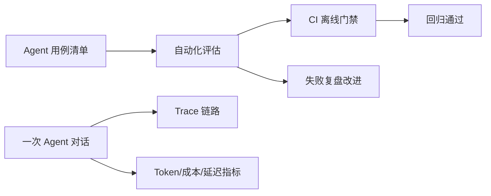

# Week 6 学习总结：Evaluation + Observability

> 日期范围：2026-09-01 ~ 2026-09-03 ｜ 归档：`05-记录/归档/2026-09-03-Week6-Day7-周总结.md`

## 一句话概括这一周

前面几周 Agent 已经“能用、能安全上生产”，这一周回答两个更难的问题：**怎么证明它一直好用？怎么在出问题时快速定位？**

- **Evaluation**：把 Agent 行为变成可回归的评估用例。
- **Observability**：用 Trace 和指标还原一次调用，做预算和排障。

## 本周全景图



左边是评估闭环，右边是可观测性闭环，两者合在一起就是“Agent 生产质量保障”。

## 六天回顾（每天重点 + 例子说明）

### Day 1：评估用例清单

- 做了什么：把订单、审批、RAG、路由、多 Agent、MCP、安全等核心场景列成 `AgentEvalCaseCatalog`。
- 企业例子：SaaS 多租户隔离，t1 客服看 399，t2 客服看 1299。
- 验证：`AgentEvalCaseCatalogTest` + `EvalCaseSmokeLiveTest`。

### Day 2：自动化评估脚本

- 做了什么：实现正确性关键词检查和引用准确性检查。
- 正确性：回答包含所有关键事实即通过；引用准确性：`[n]` 必须指向正确文档。
- 企业例子：客服回访话术必须保留 O1001 和 399。
- 验证：`AgentEvaluationServiceTest` + `AgentEvaluationLiveTest`。

### Day 3：接入 Trace

- 做了什么：用 `AgentTracer` 记录 `AGENT:chat` 根 Span 和 `TOOL:getOrder` 子 Span。
- 关键 API：`beforeToolExecution / afterToolExecution` 自动包住工具调用。
- 企业例子：客服查订单慢时，Trace 能看出慢在模型还是工具。
- 验证：`AgentTracerTest` + `TraceLiveTest`。

### Day 4：Token / 成本 / 延迟指标

- 做了什么：从 `ChatResponse.tokenUsage()` 取 Token，按单价算成本，记录延迟并汇总。
- 企业例子：带工具调用的客服查单，用 `AiServiceResponseReceivedListener` 累计多轮 Token，避免成本低估。
- 验证：`CostCalculatorTest`、`UsageMetricsServiceTest` + `UsageMetricsLiveTest`。

### Day 5：评估接入 CI

- 做了什么：新增离线门禁测试、`eval-ci.ps1` 脚本、GitHub Actions 工作流。
- 设计：CI 离线阶段不需要 Key；真实联调阶段需要 Key，可手动或定时跑。
- 验证：`eval-ci.ps1` + `CiEvaluationGateLiveTest`。

### Day 6：失败用例复盘

- 做了什么：用 `EvalRegressionRunner` 自动收集失败，形成“失败 → 复盘 → 修复 → 回归”闭环。
- 关键语法：`Function<AgentEvalCase, String>` 把“答案来源”当参数传，`apply()` 调用它。
- 企业例子：客服订单查询缺金额 → 复盘中换真实订单 Agent → 回归通过。
- 验证：`EvalRegressionRunnerTest` + `FailureReviewLiveTest`。

## 核心技术点速查

| 技术点 | 作用 | 关键类 / API |
| --- | --- | --- |
| 评估用例 | 把核心场景变成可回归清单 | `AgentEvalCase`、`AgentEvalCaseCatalog` |
| 正确性 | 关键事实是否出现 | `AgentEvaluationService.evaluateCorrectness` |
| 引用准确性 | 引用编号是否指向正确文档 | `RagEvaluator.citationCorrect` |
| Trace | 一次对话全链路可追踪 | `AgentTracer`、`beforeToolExecution` |
| 用量指标 | Token / 成本 / 延迟 | `UsageMetricsService`、`ChatResponse.tokenUsage()` |
| CI 门禁 | 每次提交自动回归 | `.github/workflows/agent-eval-ci.yml` |
| 失败复盘 | 自动收集失败并改进 | `EvalRegressionRunner`、`Function` |

几个值得反复看的 Java 语法：

- `Function<A, B>`：把「A 转成 B 的函数」当参数传。
- `->` Lambda：`ignored -> "固定答案"`、`evalCase -> orderAgent.chat(evalCase.input())`。
- `AtomicReference.updateAndGet(...)`：线程安全地更新累计值。
- `try / finally`：保证指标、Trace 在异常时也能记录。

## 面试问题

- **Agent 输出不确定，如何做回归测试？**
  把核心场景写成评估用例，检查关键事实是否出现、引用是否正确；每次改动跑 CI 回归，而不是靠“今天问一次对了”。

- **Evaluation 和单元测试的关系？**
  单元测试验证代码结构/逻辑，Evaluation 验证 Agent 行为质量。两者互补：单元测试快且稳定，Evaluation 面向自然语言输出，通常还需要真实联调阶段。

- **一次 Agent 调用如何追踪完整链路？**
  给对话建立根 Span，给每次工具调用建立子 Span；结合 Token 用量、成本、延迟指标，就能还原“模型调用了几次、每次多慢、花了多少”。

## 全部测试命令汇总

```powershell
cd F:\ChatGPT\学习之路\04-项目\enterprise-agent

# 离线评估 / 观测单元测试（无需 DeepSeek Key）
mvn test -Dtest=AgentEvalCaseCatalogTest,AgentEvaluationServiceTest,CiEvaluationGateTest,EvalRegressionRunnerTest,AgentTracerTest,CostCalculatorTest,UsageMetricsServiceTest

# 真实 DeepSeek 联调（需要 Key）
.\scripts\test-live.ps1 -Test EvalCaseSmokeLiveTest
.\scripts\test-live.ps1 -Test AgentEvaluationLiveTest
.\scripts\test-live.ps1 -Test TraceLiveTest
.\scripts\test-live.ps1 -Test UsageMetricsLiveTest
.\scripts\test-live.ps1 -Test CiEvaluationGateLiveTest
.\scripts\test-live.ps1 -Test FailureReviewLiveTest
```

## 知识库更新记录

- `02-知识库/Evaluation/`：Day1、Day2、Day5、Day6 笔记 + 本篇 `Week6-学习总结.md`
- `02-知识库/可观测性/`：Day3、Day4 笔记
- `01-每周学习/Week-06-Evaluation与可观测性/`：学习目标全部勾选、周总结填写
- `05-记录/归档/`：Day1~Day7 归档文件
