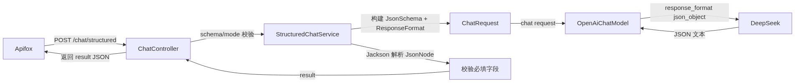
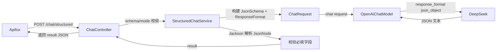

# JSON Schema 结构化输出（Day 4）

> 归档：`05-记录/归档/2026-08-14-Day4-结构化输出.md` ｜ 项目：`04-项目/enterprise-agent`

## 一、为什么需要结构化输出

- 普通对话返回自由文本，程序很难直接消费。
- 结构化输出让模型按约定的 JSON 结构返回（字段名、类型、枚举值），前端/后端可以直接解析使用。

## 二、LangChain4j 的结构化 API（1.18）

```java
JsonSchema schema = JsonSchema.builder()
        .name("extract_info")
        .rootElement(JsonObjectSchema.builder()
                .addStringProperty("summary", "内容摘要")
                .addEnumProperty("sentiment", List.of("positive", "neutral", "negative"))
                .addProperty("keywords", JsonArraySchema.builder()
                        .items(JsonStringSchema.builder().build()).build())
                .required("summary", "keywords", "sentiment")
                .build())
        .build();

ResponseFormat format = ResponseFormat.builder()
        .type(ResponseFormatType.JSON)
        .jsonSchema(schema)
        .build();

ChatRequest request = ChatRequest.builder()
        .messages(chatMessages)
        .responseFormat(format)
        .build();
```

- 关键类型：`JsonSchema`（name + rootElement）、`JsonObjectSchema`（properties + required）、`JsonArraySchema`（items）、`JsonStringSchema` / `JsonIntegerSchema` / `JsonBooleanSchema` / `JsonEnumSchema`。
- 通过 `ChatRequest.responseFormat(...)` 按请求指定，不需要改模型 Bean。

## 三、两种模式（重要，与模型供应商相关）

| 模式 | 实现 | 适用 | 说明 |
| --- | --- | --- | --- |
| `json_object`（默认） | `ResponseFormat.JSON` + 在 system prompt 里写明 JSON 结构 + 服务端解析后按 Schema 校验必填字段 | **DeepSeek 兼容** | API 只保证「是 JSON」，结构靠 prompt + 客户端校验 |
| `json_schema` | `ResponseFormat` + `jsonSchema(...)` 原生严格模式 | OpenAI 系 | API 强约束 schema，最可靠 |

## 四、踩坑：DeepSeek 不支持原生 json_schema（2026-08-14 实测）

- 请求带 `response_format.type=json_schema` 时，DeepSeek 返回：
  `{"error":{"message":"This response_format type is unavailable now", ...}}`
- 结论：当前 DeepSeek 的 `deepseek-chat` 只支持 `json_object` 模式；`json_schema` 严格模式是 OpenAI 系能力。
- 应对：默认用 `json_object` + prompt 强化 + 服务端字段校验；把 schema 定义保留在代码里，将来换支持严格模式的模型时直接切 `mode=json_schema`。

## 五、请求流程





## 六、测试

- 单测：mock 模型返回固定 JSON，断言解析、字段校验、ResponseFormat 是否正确附带。
- 真实联调：`StructuredChatServiceLiveTest`（默认跳过，设 `DEEPSEEK_API_KEY` 后运行），用中文输入实测抽取 summary/keywords/sentiment。

## 七、下一步

- Day 5：Retry / Timeout / Fallback + 统一错误处理完善