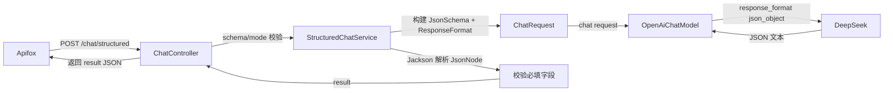

# JSON Schema 结构化输出（Day 4）

> 归档：`05-记录/归档/2026-08-14-Day4-结构化输出.md` ｜ 项目：`04-项目/enterprise-agent`

## 一、为什么需要结构化输出

- 普通对话返回自由文本，程序很难直接消费。
- 结构化输出让模型按约定的 JSON 结构返回（字段名、类型、枚举值），前端/后端可以直接解析使用。

## 二、LangChain4j 的结构化 API（1.18）

```java
JsonSchema schema = JsonSchema.builder()
        .name("extract_info")
        .rootElement(JsonObjectSchema.builder()
                .addStringProperty("summary", "内容摘要")
                .addEnumProperty("sentiment", List.of("positive", "neutral", "negative"))
                .addProperty("keywords", JsonArraySchema.builder()
                        .items(JsonStringSchema.builder().build()).build())
                .required("summary", "keywords", "sentiment")
                .build())
        .build();

ResponseFormat format = ResponseFormat.builder()
        .type(ResponseFormatType.JSON)
        .jsonSchema(schema)
        .build();

ChatRequest request = ChatRequest.builder()
        .messages(chatMessages)
        .responseFormat(format)
        .build();
```

- 关键类型：`JsonSchema`（name + rootElement）、`JsonObjectSchema`（properties + required）、`JsonArraySchema`（items）、`JsonStringSchema` / `JsonIntegerSchema` / `JsonBooleanSchema` / `JsonEnumSchema`。
- 通过 `ChatRequest.responseFormat(...)` 按请求指定，不需要改模型 Bean。

## 三、两种模式（重要，与模型供应商相关）

| 模式 | 实现 | 适用 | 说明 |
| --- | --- | --- | --- |
| `json_object`（默认） | `ResponseFormat.JSON` + 在 system prompt 里写明 JSON 结构 + 服务端解析后按 Schema 校验必填字段 | **DeepSeek 兼容** | API 只保证「是 JSON」，结构靠 prompt + 客户端校验 |
| `json_schema` | `ResponseFormat` + `jsonSchema(...)` 原生严格模式 | OpenAI 系 | API 强约束 schema，最可靠 |

## 四、踩坑：DeepSeek 不支持原生 json_schema（2026-08-14 实测）

- 请求带 `response_format.type=json_schema` 时，DeepSeek 返回：
  `{"error":{"message":"This response_format type is unavailable now", ...}}`
- 结论：当前 DeepSeek 的 `deepseek-chat` 只支持 `json_object` 模式；`json_schema` 严格模式是 OpenAI 系能力。
- 应对：默认用 `json_object` + prompt 强化 + 服务端字段校验；把 schema 定义保留在代码里，将来换支持严格模式的模型时直接切 `mode=json_schema`。

## 五、请求流程




## 六、测试

- 单测：mock 模型返回固定 JSON，断言解析、字段校验、ResponseFormat 是否正确附带。
- 真实联调：`StructuredChatServiceLiveTest`（默认跳过，设 `DEEPSEEK_API_KEY` 后运行），用中文输入实测抽取 summary/keywords/sentiment。

## 七、典型使用场景（为什么按 schema 入参构建）

核心价值：把「模型说什么」变成「模型**按约定的格式**说什么」，程序才能可靠消费 AI 输出。
一个 `/chat/structured` 接口通过 `schema` 入参服务多种场景，服务端不硬编码业务结构。

| 场景 | 示例 | schema（本项目内置） |
| --- | --- | --- |
| 信息抽取 | 客户反馈 → 摘要/情绪/关键词 | `extract` → `{summary, keywords, sentiment}` |
| 工单/客服 | 留言 → 分类/优先级/是否需要人工 | `ticket` → `{category, priority, needs_human, reply}` |
| 内容分类打标 | 审核、意图识别、多标签 | `classify` → `{category, tags[], confidence}` |
| 非结构化转结构化 | 简历解析、合同字段、商品属性 | `resume` → `{name, years, skills[], education[]}` |
| 电商商品 | 商品信息抽取入库 | `product` → `{name, category, price, stock_status}` |
| 多业务线复用 | 电商/客服/法务共用同一接口 | 各业务线传自己的 schema |
| 工具参数（预告） | Agent 决定「调哪个工具、填什么参数」 | 工具参数 JSON Schema（Week 2 Tool Calling） |

### 设计要点
- **接口复用**：新增业务结构只需加一个 schema 定义，核心链路（解析→约束→校验→返回）不用改。
- **输出即契约**：字段名/类型/枚举都是约定，下游代码直接消费，无需解析自由文本。
- **约束幻觉**：Schema 限定输出，配合服务端 `validateRequiredFields` 兜底，脏数据不进入业务系统。
- **生产注意**：建议用 schema 白名单（本项目即内置 5 种），不要让客户端传任意 JSON Schema，防滥用/注入/成本问题；校验失败要有重试或明确报错。

## 八、下一步

- Day 5：Retry / Timeout / Fallback + 统一错误处理完善