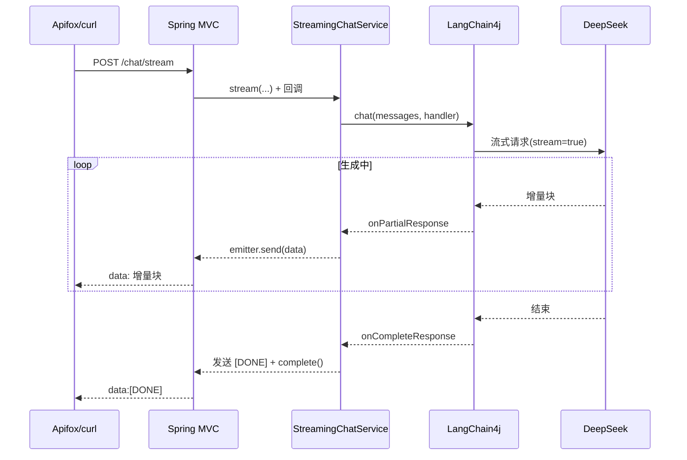

# SSE 流式输出（Day 3）

> 归档：`05-记录/归档/2026-08-13-Day3-流式输出.md` ｜ 项目：`04-项目/enterprise-agent`

## 一、SSE 是什么

- **SSE（Server-Sent Events）**：基于 HTTP 的服务器单向推送协议。
- 响应 Content-Type 为 `text/event-stream`，服务器可以持续发送多个 `data:` 事件，浏览器/客户端逐条接收。
- 一次 HTTP 连接持续到服务器发完（如 `[DONE]`）或断开。

```text
data:第一块
data:第二块
data:[DONE]
```

- 与 **WebSocket** 的区别：SSE 单向（服务器→客户端）、基于普通 HTTP、自动重连；WebSocket 双向、需要单独协议。LLM 打字机效果用 SSE 就够。

## 二、为什么流式输出重要

- 用户体验：一次性等 5~10 秒 vs 逐字显示，感知延迟差别巨大。
- 对话场景（LLM）下流式是标配能力。

## 三、Spring Boot 侧实现（SseEmitter）

- Spring MVC 提供 `SseEmitter`：控制器直接返回它，Spring 保持异步连接。
- 用法：`emitter.send(SseEmitter.event().data(partial))` 发一块；结束 `emitter.complete()`；异常 `emitter.completeWithError(e)`。
- **中文乱码坑**：默认响应编码是 ISO-8859-1，SSE 发中文会乱码。必须显式 `response.setCharacterEncoding("UTF-8")`，并建议 `produces = "text/event-stream;charset=UTF-8"`。

## 四、LangChain4j 流式 API（1.18）

- 模型：`OpenAiStreamingChatModel`（与 `OpenAiChatModel` 同款 builder：baseUrl/apiKey/modelName）。
- 调用：`chatModel.chat(List<ChatMessage>, StreamingChatResponseHandler)`。
- 回调接口 `StreamingChatResponseHandler` 三个关键方法：
  - `onPartialResponse(String)` —— 每收到一块增量文本
  - `onCompleteResponse(ChatResponse)` —— 完整回复结束
  - `onError(Throwable)` —— 出错
- DeepSeek 支持 OpenAI 兼容的流式接口，LangChain4j 自动解析。

## 五、请求流程



## 六、测试

- 单元：Mock 掉 `OpenAiStreamingChatModel`，手动触发 `onPartialResponse/onCompleteResponse/onError` 断言回调。
- 接口：`@WebMvcTest` + MockMvc 异步（`asyncStarted` → `asyncDispatch`），断言 SSE 文本与 `[DONE]`。
- 真实联调：`StreamingChatServiceLiveTest`（默认跳过，设置 `DEEPSEEK_API_KEY` 后运行），断言收到多个分块。

## 七、下一步

- Day 4：Structured Output（JSON Schema 约束输出）
- Day 5：Retry / Timeout / Fallback