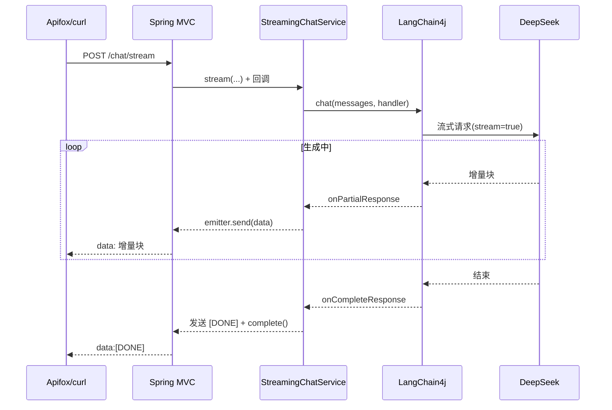

# SSE 流式输出（Day 3）

> 归档：`05-记录/归档/2026-08-13-Day3-流式输出.md` ｜ 项目：`04-项目/enterprise-agent`

## 一、SSE 是什么

- **SSE（Server-Sent Events）**：基于 HTTP 的服务器单向推送协议。
- 响应 Content-Type 为 `text/event-stream`，服务器可以持续发送多个 `data:` 事件，浏览器/客户端逐条接收。
- 一次 HTTP 连接持续到服务器发完（如 `[DONE]`）或断开。

```text
data:第一块
data:第二块
data:[DONE]
```

- 与 **WebSocket** 的区别：SSE 单向（服务器→客户端）、基于普通 HTTP、自动重连；WebSocket 双向、需要单独协议。LLM 打字机效果用 SSE 就够。

## 二、为什么流式输出重要

- 用户体验：一次性等 5~10 秒 vs 逐字显示，感知延迟差别巨大。
- 对话场景（LLM）下流式是标配能力。

## 三、Spring Boot 侧实现（SseEmitter）

- Spring MVC 提供 `SseEmitter`：控制器直接返回它，Spring 保持异步连接。
- 用法：`emitter.send(SseEmitter.event().data(partial))` 发一块；结束 `emitter.complete()`；异常 `emitter.completeWithError(e)`。
- **中文乱码坑**：默认响应编码是 ISO-8859-1，SSE 发中文会乱码。必须显式 `response.setCharacterEncoding("UTF-8")`，并建议 `produces = "text/event-stream;charset=UTF-8"`。

## 四、LangChain4j 流式 API（1.18）

- 模型：`OpenAiStreamingChatModel`（与 `OpenAiChatModel` 同款 builder：baseUrl/apiKey/modelName）。
- 调用：`chatModel.chat(List<ChatMessage>, StreamingChatResponseHandler)`。
- 回调接口 `StreamingChatResponseHandler` 三个关键方法：
  - `onPartialResponse(String)` —— 每收到一块增量文本
  - `onCompleteResponse(ChatResponse)` —— 完整回复结束
  - `onError(Throwable)` —— 出错
- DeepSeek 支持 OpenAI 兼容的流式接口，LangChain4j 自动解析。

## 五、请求流程



## 六、测试

- 单元：Mock 掉 `OpenAiStreamingChatModel`，手动触发 `onPartialResponse/onCompleteResponse/onError` 断言回调。
- 接口：`@WebMvcTest` + MockMvc 异步（`asyncStarted` → `asyncDispatch`），断言 SSE 文本与 `[DONE]`。
- 真实联调：`StreamingChatServiceLiveTest`（默认跳过，设置 `DEEPSEEK_API_KEY` 后运行），断言收到多个分块。

## 七、StreamingChatService.stream 原理（通俗版）

> 一句话：`stream()` 不是「等我算完再给你」，而是「留三个电话，边算边给你」的接线员。

### 核心代码（就 30 行）

```java
public void stream(String systemPrompt, List<ChatRequest.Message> messages,
                   Consumer<String> onPartial, Runnable onComplete, Consumer<Throwable> onError) {
    // ① 出门前先检查：把入参翻译成模型能懂的消息
    List<ChatMessage> chatMessages = buildMessages(systemPrompt, messages);
    // ② 把消息交给模型，同时留下三个"电话"
    streamingChatModel.chat(chatMessages, new StreamingChatResponseHandler() {
        @Override
        public void onPartialResponse(String partialResponse) { // 电话1：来了一块文字
            onPartial.accept(partialResponse);
        }
        @Override
        public void onCompleteResponse(ChatResponse completeResponse) { // 电话2：全部说完了
            onComplete.run();
        }
        @Override
        public void onError(Throwable error) { // 电话3：出错了
            onError.accept(error);
        }
    });
}
```

### 三步拆解

**① 出门前先检查（buildMessages）**
- 把 `systemPrompt` 和 `messages` 翻译成 LangChain4j 的消息对象（`SystemMessage` / `UserMessage` / `AiMessage`）。
- 这一步是**同步**的：如果 role 不合法，在这里就抛异常（→ 400），根本不会去调模型，避免白花钱、白等待。

**② 留下三个"电话"（注册回调）**
- `chatModel.chat(消息, 处理器)` 只是把消息发给模型，同时登记三个回调：
  - `onPartial`：模型每吐出一小块文字 → 打这个电话把文字递过来
  - `onComplete`：整段话说完了 → 打这个电话通知"结束"
  - `onError`：出错了 → 打这个电话把错误递过来

**③ 本类的工作 = 转接（接线员）**
- `StreamingChatService` 自己不做任何"生成"的事，它只做**转接**：把 LangChain4j 打来的三个电话，原样转给上层（`ChatController` 传入的三个参数）。
- 好处：上层想怎么用都行——发给浏览器、统计字数、写日志……本类完全不关心。

### 为什么用"电话"（回调）而不是"返回值"

- 普通方法只能 `return` 一次，而流式结果是**多次、分块、不定时**到来的，返回值装不下。
- 生活类比：
  - 一次性 `/chat` = 外卖员一趟把整份饭送到，你站在原地等。
  - 流式 `/chat/stream` = 商家**边做边送**（先送一盘菜、再送一盘……），你留三个电话：来一盘打一个、全部做完打一个、做砸了打一个。
- `StreamingChatService` 就是那个"外卖中转站"：把商家的电话转给你。

### 谁在真正干活（异步）

- `stream()` 方法**几乎立刻返回**——它只是登记了回调就结束了。
- 真正连网络、收数据的是 LangChain4j 内部的**后台线程**。
- 这也是为什么 `ChatController` 要返回 `SseEmitter`（而不是普通对象）：Spring 需要把 HTTP 连接一直保持打开，等后台慢慢把文字一块块送过来。

### 一块文字的完整旅程

```text
DeepSeek 生成"Java 21 带来了……"
   │  通过网络一块一块发回（SSE chunk）
   ▼
LangChain4j 解析 → 触发 onPartialResponse("Java")
   ▼
StreamingChatService 转接 → onPartial.accept("Java")
   ▼
ChatController → emitter.send("Java")
   ▼
Apifox / 浏览器 → 显示 data:Java（逐字出现）
```

### 面试怎么说

> stream() 基于**回调（回调驱动/旁路通知）**：先同步做参数翻译与校验，再把消息交给流式模型并注册 onPartial/onComplete/onError 三个回调；模型在后台线程边生成边触发回调，本类只负责转接给上层，由上层（SseEmitter）把增量文本推给客户端。本质是**异步 + 多次通知**，所以不能用普通返回值。
## 八、下一步

- Day 4：Structured Output（JSON Schema 约束输出）
- Day 5：Retry / Timeout / Fallback

## 企业落地案例
- 场景：客服在线聊天窗口需要“打字机”效果，客户看到回复逐字出现，而不是等 5~10 秒一次性返回。
- 真实联调：`.\scripts\test-live.ps1 -Test StreamingChatServiceLiveTest`，验证真实 DeepSeek 流式多分块并正确结束。
