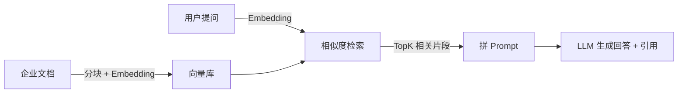

# Day 1：Embedding 与向量检索原理 + 向量库选型

> Week 3 ｜ 归档：`05-记录/归档/2026-08-18-Week3-Day1-RAG原理与选型.md` ｜ 参考：LangChain4j RAG 教程、RAG 原始论文（arXiv:2005.11401）

## 一、为什么要 RAG

LLM 训练时不知道你公司的内部知识，直接问会：编造（幻觉）、答"不知道"、或用过期信息。三种解法：

| 方案 | 思路 | 缺点 |
| --- | --- | --- |
| 微调（Fine-tune） | 用内部数据继续训练模型 | 贵、慢、数据更新要重训 |
| 长上下文硬塞 | 把文档全塞进 Prompt | Context Window 有限、贵、超长效果差 |
| **RAG（检索增强生成）** | 先把相关内容**检索**出来，再拼进 Prompt 让模型回答 | 检索质量决定回答质量（这就是本周围绕的点） |

RAG = **Retrieval（检索）** + **Augmented（增强）** + **Generation（生成）**。核心流程：

## 二、Embedding：把文字变成向量

- **Embedding 模型**把一段文本映射成一个高维向量（如 384/1536 维），语义相近的文本在向量空间里距离更近。
- 例子：「今天心情不错」和「今天很高兴」的向量距离近；和「今天下雨」距离远。
- 关键词匹配看"字面"，Embedding 看"语义"——这是 RAG 能理解同义词/口语的关键。

### 相似度计算（三种常见度量）

| 度量 | 公式思想 | 适用 |
| --- | --- | --- |
| 余弦相似度 | 两向量夹角余弦，值越大越相似（-1~1） | 最常用，不受向量长度影响 |
| 点积 | 向量逐位相乘求和 | 已归一化向量时与余弦等价 |
| 欧氏距离 | 空间直线距离，越小越相似 | 低维/聚类场景 |

LangChain4j 的 `EmbeddingStore` 默认用余弦相似度（`CosineSimilarity`）。

## 三、向量检索：ANN 近似最近邻

- 精确最近邻在百万级向量上太慢，工业界用 **ANN（近似最近邻）**：牺牲一点点精度换速度。
- 常见算法：**HNSW**（分层可导航小世界图，Qdrant/Milvus 用）、IVF、PQ。
- 学习阶段向量量小（几百条），精确检索就够了；原理上理解「按相似度取 TopK」即可。

## 四、向量数据库选型（Day 1 的决策）

| 方案 | 部署 | 适合阶段 | 说明 |
| --- | --- | --- | --- |
| **InMemoryEmbeddingStore** | 零部署，进程内存 | ✅ 学习期（Day 2~6） | LangChain4j 内置，重启丢失 |
| Qdrant | Docker/独立服务 | 生产 | HNSW、过滤、REST 客户端 |
| pgvector | PostgreSQL 插件 | 生产 | 复用现有 PG 生态 |
| Milvus | 独立分布式 | 大规模生产 | 功能最强、最重 |

**本项目选型结论**：
- 学习期（Week 3）：`InMemoryEmbeddingStore` + 本地 Embedding 模型，零依赖、零成本、不申请新服务。
- 生产期（Sprint 3）：切换 Qdrant（或 pgvector），接口不变——LangChain4j 的 `EmbeddingStore` 抽象让换库只改配置。

### Embedding 模型选型

| 模型 | 类型 | 维度 | 说明 |
| --- | --- | --- | --- |
| all-MiniLM-L6-v2 | 本地 ONNX | 384 | 免费、快、中文可用（够学习用） |
| OpenAI text-embedding-3-small | 云端 API | 1536 | 效果好、需付费/海外访问 |
| BGE（bge-small-zh） | 本地 | 512 | 中文效果更好（进阶可换） |

- 注意：**DeepSeek 不提供 Embedding API**，所以选本地模型或 OpenAI。
- 本项目选定：`langchain4j-embeddings-all-minilm-l6-v2`。

## 五、选型踩坑：模块版本

- `langchain4j-embeddings-all-minilm-l6-v2` 目前只发布了 **1.18.1-beta28**（预发布版），没有 1.18.1 稳定版。
- 学习项目可以接受 beta；若希望全稳定版，可换 `langchain4j-easy-rag` 或直接等稳定版。
- 后续 Day 2 会在 pom 里引入该依赖（注意版本号写 1.18.1-beta28）。

## 六、面试 / 工程问题（Day 1 版答案）

- 向量检索 vs 关键词检索？→ 向量看语义、关键词看字面；两者各有优劣，可做 Hybrid Search（Day 5）。
- RAG 为什么会召回错误内容？→ 分块不当、Embedding 模型弱、检索没过滤、TopK 太大带噪音（Day 3~6 逐步解决）。
- 如何防止幻觉引用？→ 检索片段带回引用元数据，生成时强制引用（Day 4）。

## 七、Day 1 完成标准

- [x] 理解 Embedding / 向量 / 相似度
- [x] 完成向量库选型（学习期 InMemory + all-minilm；生产 Qdrant/pgvector）
- [x] 通读 LangChain4j RAG 官方文档要点