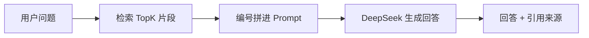

# Day 4：RAG 问答链路（检索 → 拼 Prompt → 生成 + 引用）

> Week 3 ｜ 归档：`05-记录/归档/2026-08-19-Week3-Day4-RAG问答链路.md` ｜ 代码：`com.enterprise.agent.rag.RagQaService`

## 一、本日目标

把 Day 3 的检索接上大模型，形成完整问答：**检索 → 拼 Prompt → 生成，并带引用来源**。

## 二、核心流程



## 三、关键代码

```java
public RagChatResponse ask(String question, String documentId, Integer maxResults) {
    // 1. 检索
    List<RetrievedChunk> chunks = retrievalService.retrieve(question, documentId, maxResults, 0.0);

    // 2. 拼 Prompt：编号后的参考资料 + 问题
    String context = buildContext(chunks);
    List<ChatMessage> messages = List.of(
        SystemMessage.from(SYSTEM_PROMPT),
        UserMessage.from("【参考资料】\n" + context + "\n\n【问题】\n" + question));

    // 3. 生成（复用 Day 5 容错链路）
    ChatResponse response = resilientCaller.callWithFallback(model -> model.chat(messages));
    return new RagChatResponse(response.aiMessage().text(), chunks);
}
```

## 四、Prompt 设计要点（防幻觉引用）

系统提示词约束了三件事：

1. **只根据参考资料回答，不要编造**——这是 RAG 防幻觉的核心。
2. **引用时用 [序号] 标注来源**——让答案可溯源。
3. **资料里没有就直说**——避免模型强行编答案。

参考资料格式：`[1] (来源: HR-001) 内容...`，序号和返回的 `sources` 一一对应。

## 五、接口

```http
POST /rag/chat
{ "question": "公司年假有几天？", "documentId": "HR-001" }
```

```json
{
  "answer": "根据资料[1]，入职满一年享有 5 天年假，满三年享有 10 天年假。",
  "sources": [ { "text": "...", "score": 0.87, "documentId": "HR-001" } ]
}
```

## 六、实测结果（端到端联调）

入库一篇 HR 制度文档 → 问「公司年假有几天？」→ 回答：
> 根据资料[1]，入职满一年享有 5 天年假，满三年享有 10 天年假。

答案里的「5 天」「10 天」只可能来自检索到的资料，且带了 [1] 引用。

## 七、测试

- `RagQaServiceTest`：回答带来源、Prompt 里确实拼接了参考资料。
- `RagChatControllerTest`：接口返回 answer + sources、空 question 400。
- `RagQaLiveTest`（端到端，真实 Embedding + DeepSeek）：`.\scripts\test-rag-qa-live.ps1`。

## 八、Day 4 完成标准

- [x] RAG 问答链路可用（检索 → 拼 Prompt → 生成）
- [x] 回答附带引用来源（[1] + sources）