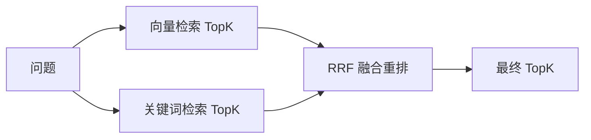

# Day 5：Reranking 与 Hybrid Search

> Week 3 ｜ 归档：`05-记录/归档/2026-08-20-Week3-Day5-Reranking与HybridSearch.md` ｜ 代码：`com.enterprise.agent.rag.HybridSearchService`

## 一、为什么单靠向量检索不够

向量检索看「语义」，但在这些情况会漏：
- 专有名词、编号、精确关键词（如 `O1001`、`SQL-92`）——Embedding 未必抓住字面。
- 中文口语和文档用词不同。
- 简短的强匹配词，向量相似度反而不突出。

关键词检索（BM25 之类）看「字面」，恰好互补。**Hybrid Search = 向量检索 + 关键词检索**。

## 二、两种检索的对比

| 维度 | 向量检索 | 关键词检索 |
| --- | --- | --- |
| 匹配依据 | 语义相似度 | 字面命中 |
| 擅长 | 同义改写、模糊语义 | 精确词、编号、专名 |
| 弱项 | 专有名词/编号 | 同义改写 |

## 三、关键词索引（本日新增 InMemoryCorpus）

入库时除了写向量库，还同步把原文片段放进 `InMemoryCorpus`：

```java
private final List<TextSegment> segments = new CopyOnWriteArrayList<>();
public void addAll(List<TextSegment> newSegments) { segments.addAll(newSegments); }
```

这就是一个极简的「关键词索引」——真实系统会用 BM25/倒排索引，学习期用内存扫描足够。

## 四、关键词打分：字符 bigram（新语法）

中文没有空格分词，用一个轻量技巧：把文本切成**相邻两字符的集合（bigram）**，用集合交集大小打分。

```java
private Set<String> bigrams(String text) {
    Set<String> grams = new HashSet<>();
    String cleaned = text.toLowerCase().replaceAll("[^\\p{L}\\p{N}]", "");
    for (int i = 0; i + 1 < cleaned.length(); i++) {
        grams.add(cleaned.substring(i, i + 2));
    }
    return grams;
}

// 交集大小 = 命中程度
private double overlap(Set<String> a, Set<String> b) {
    Set<String> intersection = new HashSet<>(a);
    intersection.retainAll(b);
    return intersection.size();
}
```

- `\\p{L}`（任意语言字母）和 `\\p{N}`（数字）是 Java 正则的 Unicode 类别；`[^\\p{L}\\p{N}]` 表示去掉标点/空格，只留字和数字。
- bigram 是「字符 n-gram」的 n=2 特例，对中英文都适用，不用分词器。

## 五、RRF：倒数排名融合（重排核心）

两路结果排名不一样，不能直接拼。用 **Reciprocal Rank Fusion**：

```java
// 每条结果按名次加分：1 / (k + rank)，k 通常取 60
entry.score += 1.0 / (RRF_K + i + 1);   // i 是 0 起的名次
```

最后按融合分排序取 TopK。RRF 就是「重排（Reranking）」的一种：**对初检候选重新打分、重新排序**，让两路都认可的片段排前面。

**更进阶的重排**：用专门的 Cross-Encoder 模型给「问题+片段」逐对打分（更准但更贵），或用 LLM 对候选打分；本日用 RRF 是零成本版本。

## 六、完整流程



## 七、接入问答链路

`RagQaService` 的检索从「纯向量」换成 `HybridSearchService.search(...)`，其它不变。同时新增 `POST /rag/hybrid-search` 独立接口，方便对比向量检索和混合检索的效果。

## 八、验证

- `HybridSearchServiceTest`（2 个）：向量+关键词合并、documentId 过滤。
- `RagHybridSearchControllerTest`（2 个）：接口返回、空 query 400。
- `RagQaLiveTest` 端到端：入库 → 混合检索 → DeepSeek 生成，回答带 [1] 引用（实测通过）。

## 九、Day 5 完成标准

- [x] 加入 Hybrid Search（向量 + 关键词）
- [x] 加入 Reranking（RRF 融合重排）