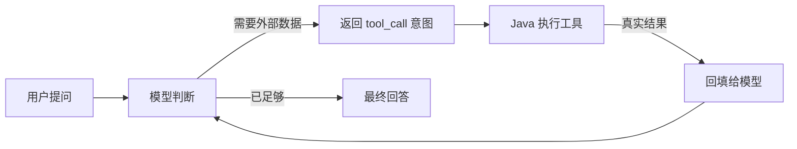

# Day 1：Function Calling 原理

> Week 2 ｜ 资料：LangChain4j Tools 文档、OpenAI Function Calling 文档

## 一、Function Calling 是什么

- 普通 LLM 只会「根据上下文生成文本」，不知道你的业务数据（订单、库存、物流）。
- **Function Calling（函数调用 / Tool Calling）**：模型在回答前可以输出一个**结构化意图**——「我要调用哪个函数 + 传什么参数」，由你的代码真正执行，再把结果还给模型继续回答。
- 关键：模型**不执行**代码，它只是"请求调用"，执行权永远在 Java 侧。

## 二、为什么需要它

| 场景 | 没有 Tool | 有 Tool |
| --- | --- | --- |
| 查订单 | 模型瞎编或说不知道 | 调 `getOrder` 拿真实数据 |
| 改订单状态 | 无法产生任何副作用 | 调 `updateOrderStatus` 真正改库 |
| 查物流 | 无法感知 | 调 `getLogistics` |

## 三、Tool 定义三要素

1. **name**（工具名）—— 如 `getOrder`
2. **description**（描述）—— 模型靠它选择工具，写清楚"什么时候用"
3. **parameters**（参数，JSON Schema）—— 每个参数的名字、类型、说明

LangChain4j 用注解自动生成这三要素：`@Tool("描述")` + `@P("参数说明")`。

## 四、Agent Loop（核心循环）

- 循环直到模型认为不再需要工具（或达到最大轮数——防死循环）。
- 每轮工具调用都会消耗一次模型请求（token 成本）。

## 五、何时该用 Tool / 何时不该用

- ✅ 该用：需要实时/私有/业务数据，或需要产生副作用（改库、发消息）。
- ❌ 不该用：纯知识问答、模型本身擅长的事；能用检索解决的先考虑 RAG（Week 3）。

## 六、面试思考

- Tool 描述写得不好会怎样？→ 模型选错工具或不敢选。
- Agent 陷入循环怎么办？→ 限制最大迭代次数（Day 6 实现）。